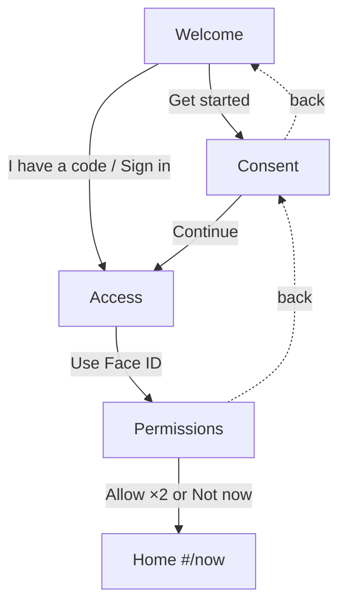

# Workflow 00 — Onboarding & first unlock

> Source: screens `scr-welcome`, `scr-consent`, `scr-access`, `scr-permissions` in `prototype/phone-app-prototype-v2.html` (hash routes `#/welcome → #/consent → #/access → #/permissions → #/now`). Not part of the demo scenario grid — this is the entry path every user walks once, and re-enters from the lock screen.

| | |
|---|---|
| **Trigger** | First launch (`registered = false`), or a returning user unlocks the phone (lock-screen swipe → `#/welcome`). |
| **Agent intent** | Register the user with informed, granular consent; get them in fast (Face ID / passcode); ask for device permissions **just in time, with a reason**. |
| **Entry points** | App cold start · lock-screen unlock. |
| **Exit / handoff** | Home screen (`#/now`) → **workflow-01-morning-dose** (or whatever the home planner schedules). |

---

## Shared conventions (apply to every agentic workflow)

**Sizing grid** — the home is a 2-column bento grid (82 px row units):
- `2×N` full-width — the main task the agent is asking about
- `1×N` half-width — secondary / ambient tiles
- 1-row strips — booked events, reminders, and "done" records

**Tone = importance, never decoration**

| Tone | Class | Use for |
|---|---|---|
| `hot` | `.now` | due right now — gradient border, top of stack |
| `high` | `.t-high` | today's care logistics (booked events, handoffs) |
| `info` | `.t-info` | reminders, FYI strips |
| `game` | `.t-game` | progress, badges, streaks |
| `good` | `.t-good` | thank-you / just-completed confirmations |
| `calm` | — | resting state ("all clear") |
| `done` | `.done` | collapsed record of an answered item |

**Non-negotiable copy rules**
- "Every answer counts the same." — identical chip sizes, zero judgment for any answer (incl. "Missed it", "Not sure").
- The agent never answers clinical questions — it hands off to the care team.
- The agent never invents care tasks. Nothing due → calm resting card only.
- New tiles animate in staggered (`agent-in`, 45 ms delay per tile). Respect `prefers-reduced-motion`.

---

## 1. Preconditions (agent knowledge)

```json
{
  "registered": false,
  "consent": {
    "ownCare": "always_on",
    "deidentifiedResearch": "off",
    "namedResearch": "not_offered"
  },
  "auth": { "method": null },
  "permissions": { "microphone": "ask", "notifications": "ask" }
}
```

Onboarding screens are **full-screen stacks, not bento tiles** — the agent updates screen content and CTA state; it does not plan tiles here.

## 2. Screen plan

| Step | Screen | Progress dots | Purpose |
|---|---|---|---|
| 0 | Welcome | — | Brand, promise, two ways in |
| 1 | Consent | dot 1 of 3 on | Three separate data decisions |
| 2 | Access | — | Fast auth (Face ID / passcode) |
| 3 | Permissions | dot 2 of 3 on | Mic + notifications, each with a reason |
| 4 | Home | — | Agent takes over (bento planner) |

## 3. Flow



Step by step:

1. **Welcome** — brand mark, headline "Agentic Kinetic", promise: "Your care, day by day. Check in with one tap, talk instead of typing, and your care team sees the full picture."
   - Primary: **Get started** → consent.
   - Links: **I have a code from my care team** → access · **Sign in** → access.
2. **Consent** — headline "Your data, your choice"; subline: "Three separate decisions. You can change the optional ones at any time, and changing your mind is always recorded."
   - **Care for you** — toggle *always on* (filled): "The data behind your own care. Always on."
   - **Better care for everyone** — toggle *off by default*: "De-identified only. Yours to switch off, any time."
   - **Research that names you** — hatched, *disabled*: "Not offered in this app."
   - **Continue** → access.
3. **Access** — "Welcome back", 6 passcode dots (demo shows 2 filled), primary **Use Face ID** → permissions. Link **Call your care team** → toast "Demo — no call placed" (never leaves the flow).
4. **Permissions** — headline "Two permissions, both earning their place"; subline: "Each one is asked for when it is needed, and says why."
   - **Microphone** — "Only while using the app. You talk, it types." → **Allow**
   - **Notifications** — "Your check-in nudge and booking reminders." → **Allow**
   - **Not now** link → skips to home with **no penalty and no re-ask nag**.
5. **Home** — the bento planner takes over (→ workflow-01-morning-dose).

## 4. State mutations

| Interaction | Mutation |
|---|---|
| Toggle "Better care for everyone" | `consent.deidentifiedResearch: off ↔ on` (change is recorded + timestamped) |
| **Continue** | screen `consent → access` |
| **Use Face ID** | `auth.method = "face_id"`; screen `access → permissions` |
| **Allow (mic)** | `permissions.microphone = "granted"` |
| **Allow (notifications)** | `permissions.notifications = "granted"` |
| **Not now** | permissions stay `"ask"` → re-prompted only when a feature needs them |
| Any arrival at home | `registered = true` |

## 5. Guardrails

- Consent is **granular and reversible**; "Research that names you" is never offered, never hinted at.
- Permissions are **just-in-time with a stated reason** — never a wall of OS prompts at launch.
- Skipping ("Not now") must never block care or gate any check-in.
- The app **discloses AI use** (menu: "This app uses AI") — the agent may be referenced but never pretends to be a human clinician.

## 6. CopilotKit mapping

**Shared agent state (`useCoAgent`)** — `registered`, `consent.*`, `auth.method`, `permissions.*` are read by every later workflow (voice needs `microphone`; reminders need `notifications`).

**Actions (`useCopilotAction`)**

| Action | Args | Render / effect |
|---|---|---|
| `start_registration` | — | routes to consent, sets step dots |
| `record_consent` | `scope: "deidentified_research" \| "own_care"`, `choice: boolean` | toggles the row, logs the change |
| `authenticate` | `method: "face_id" \| "passcode"` | fills dots, advances to permissions |
| `grant_permission` | `permission: "microphone" \| "notifications"` | flips row to granted, enables the other |
| `skip_permissions` | — | routes home, marks soft-declined |

**Generative-UI components**: `WelcomeScreen`, `ConsentScopeRow` (toggle states: filled / off / hatched-na), `PinDots`, `PermissionRow`.
