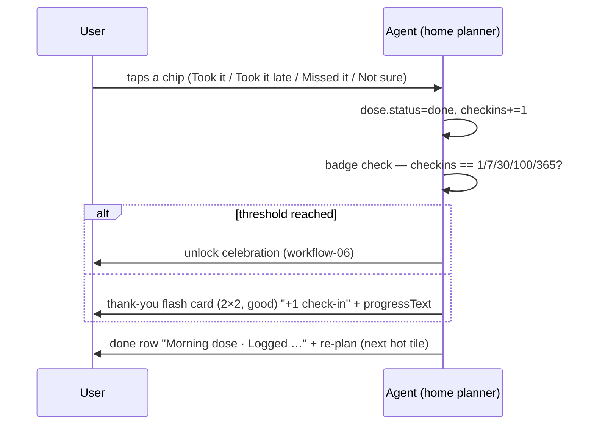

# Workflow 01 — Morning dose check-in

> Source: demo scenario `data-sc="morning"` → dose card, weight **80**, layout `{cols:2, rows:3, tone:'hot'}` in `prototype/phone-app-prototype-v2.html` (`AK.reg` main group; `logDose()`).

| | |
|---|---|
| **Trigger** | `daypart === "morning"` **and** `dose.status === "due"` |
| **Agent intent** | Get one honest answer to "How did this morning's dose go?" — the daily check-in that feeds check-ins, levels and badges. |
| **Entry points** | Home planner · lock-screen notification ("Morning dose") · dose voice note (workflow-01b voice variant below) |
| **Exit / handoff** | `dose.status = "done"` → done row + thank-you flash; if the answer lands on a badge threshold → **workflow-06-badge-unlock**; if the care-team question is still waiting it becomes the next `hot` tile (**workflow-03**) |

---

## Shared conventions (apply to every agentic workflow)

**Sizing grid** — the home is a 2-column bento grid (82 px row units): `2×N` full-width = the main task; `1×N` half-width = secondary/ambient tiles; 1-row strips = booked events, reminders, done records.

**Tone = importance, never decoration**

| Tone | Class | Use for |
|---|---|---|
| `hot` | `.now` | due right now — gradient border, top of stack |
| `high` | `.t-high` | today's care logistics |
| `info` | `.t-info` | reminders, FYI |
| `game` | `.t-game` | progress, badges, streaks |
| `good` | `.t-good` | thank-you / just-completed confirmations |
| `calm` | — | resting state |
| `done` | `.done` | collapsed record of an answered item |

**Non-negotiable copy rules**
- "Every answer counts the same." — identical chip sizes, zero judgment for any answer (incl. "Missed it", "Not sure").
- The agent never answers clinical questions — it hands off to the care team.
- The agent never invents care tasks. Nothing due → calm resting card only.
- New tiles animate in staggered (`agent-in`, 45 ms per tile). Respect `prefers-reduced-motion`.

---

## 1. Preconditions (agent knowledge)

```json
{
  "clock": "09:40", "daypart": "morning",
  "checkins": 31,
  "dose": { "status": "due", "answer": null },
  "nextSample": { "booked": true, "when": "Sun 11 Oct", "tomorrow": false },
  "teamQuestion": { "status": "waiting", "text": "Did you start any new medicine this week?" },
  "temp": { "due": false, "status": "none" },
  "newMed": null, "handoff": null, "symptoms": [], "vomit": null,
  "reminders": [], "flash": null, "unlock": null
}
```

## 2. Home stack plan

| Priority | Widget | Layout | Tone | Weight |
|---|---|---|---|---|
| 1 | Morning dose question | `2×3` | `hot` | 80 |
| 2 | Care-team question (if waiting) | `2×2` | `hot` | 74 |
| 3 | Booked sample row → "Sun 11 Oct · Fingerstick samples" | `2×1` strip | `high` | 50 (sub) |
| 4 | Badges square → progressText, taps to milestone screen | `1×2` | `game` | 40 (sub) |
| 5 | Care team square → "Call or message" | `1×2` | `calm` | 39 (sub) |

After answering, a **done row** (`Morning dose · Logged [· late/missed/not sure]`) rises to the top of the stack.

## 3. Flow



Step by step:

1. Agent renders the dose card: eyebrow `pip · Now · morning dose`, headline "How did this morning's dose go?", reassurance line "Every answer counts the same."
2. Four equal chips in a 2×2 grid: **Took it · Took it late · Missed it · Not sure**.
3. Any chip → `logDose(answer)`: dose done, `checkins += 1`, badge-threshold check, flash set.
4. Thank-you card (`good`): "Thanks for telling us!" / "Your care team now has the full picture." + `+1 check-in` pill + progress text ("3 more check-ins to First month").
5. Stack re-plans: done row appears; the care-team question (if waiting) becomes the new `hot` tile.

### Voice variant (dose note)

User holds the mic FAB → listening popover (wave + "Release to send" + "Only the words are kept. The voice itself is never analysed.") → result state:

- "You said" — “I took it late, around eleven, after breakfast.”
- "Here's what I noted" rows: **Dose** · Late · about 11:00 (Change) · **Food** · After breakfast (Change) · **Typical day?** · Yes (Change)
- **Looks right** → `logDose("late")` (+1, same rewards) · **Say it again** → back to listening.

### Lock-screen variant

Notification: **"Morning dose — How did this morning's dose go?"** with inline chips **Took it** / **Took it late**; tapping either opens home with the dose card pre-focused.

## 4. Widget specs

- Card: `w compact`, tone class `now`; eyebrow icon `pip`; headline ≤ 6 words.
- Chips: `.answers` default 2-column grid, `min-height:52px`, identical typography — **never** visually rank answers.
- Done row: check disc + "Morning dose" + right-aligned status ("Logged", "Logged · late", "Logged · missed", "Logged · not sure").
- Flash card: `2×2`, tone `good`, centered, `+1` pill only for dose check-ins.

## 5. State mutations

| Field | After |
|---|---|
| `dose.status` | `"done"` |
| `dose.answer` | `"taken" \| "late" \| "missed" \| "not_sure"` |
| `checkins` | `+1` — **the only action that increments check-ins** |
| `flash` | `{ plus: true }` (unless superseded by `unlock`) |
| `unlock` | badge object if `checkins` hits 1 / 7 / 30 / 100 / 365 |

## 6. Guardrails

- **No judgment**: "Missed it" produces the same +1, the same thank-you, the same progress as "Took it". No streak-breaking, no red, no shame.
- "Not sure" is recorded honestly and surfaced to the care team — never coerced into a guess.
- The agent never reminds more than once per dose and never scolds.

## 7. CopilotKit mapping

**Shared agent state (`useCoAgent`)**: `dose`, `checkins`, `flash`, `unlock` (full schema per workflow conventions).

**Actions (`useCopilotAction`)**

| Action | Args | Render / effect |
|---|---|---|
| `render_dose_prompt` | — | renders the 2×3 `hot` dose card with chips |
| `answer_dose` | `answer: "taken"\|"late"\|"missed"\|"not_sure"` | calls `logDose`, re-plans stack |
| `render_thanks_card` | `plus: boolean` | flash card, `good` tone |
| `render_done_row` | `label`, `status` | done strip |
| `confirm_voice_note` | `noted: { dose, food, typicalDay }` | "Looks right" commit path |

**Generative-UI components**: `DosePromptCard`, `ThanksCard`, `DoneRow`, `VoiceListeningPop`, `VoiceResultPop`.
