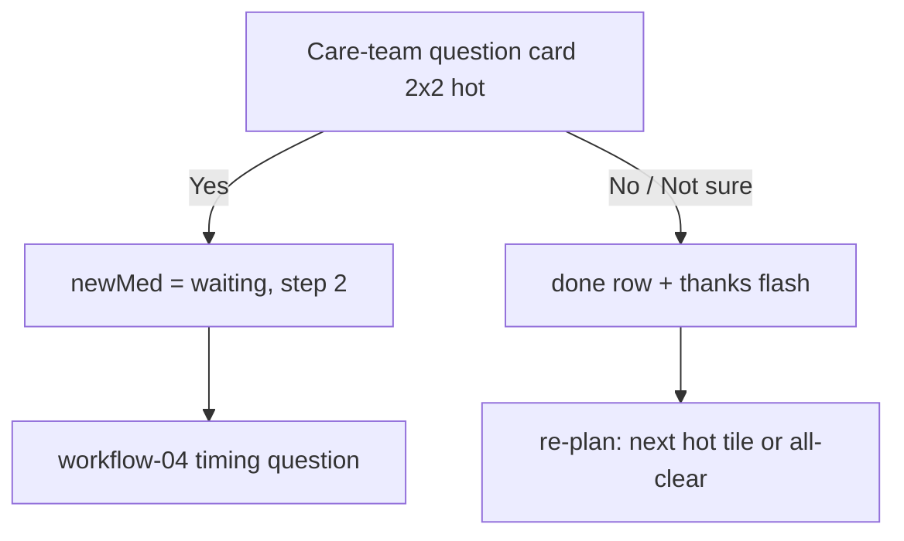

# Workflow 03 — Care-team question

> Source: demo scenario `data-sc="question"` → care-team question card, weight **74**, layout `{cols:2, rows:2, tone:'hot'}`, chips rendered `.answers.three` in `prototype/phone-app-prototype-v2.html`.

| | |
|---|---|
| **Trigger** | `teamQuestion && teamQuestion.status === "waiting"` — a question authored by the human care team. |
| **Agent intent** | Deliver the care team's question faithfully, capture one honest answer, route follow-ups. |
| **Entry points** | Home planner · milestone screen cross-link row ("Your care team asks · 1 question waiting"). |
| **Exit / handoff** | Answer "Yes" → seeds **workflow-04-new-medicine-watch** at step 2 (timing question). "No" / "Not sure" → done row + thank-you flash. |

---

## Shared conventions (apply to every agentic workflow)

**Sizing grid** — the home is a 2-column bento grid (82 px row units): `2×N` full-width = the main task; `1×N` half-width = secondary/ambient tiles; 1-row strips = booked events, reminders, done records.

**Tone = importance, never decoration**

| Tone | Class | Use for |
|---|---|---|
| `hot` | `.now` | due right now — gradient border, top of stack |
| `high` | `.t-high` | today's care logistics (booked events, handoffs) |
| `info` | `.t-info` | reminders, FYI strips |
| `game` | `.t-game` | progress, badges, streaks |
| `good` | `.t-good` | thank-you / just-completed confirmations |
| `calm` | — | resting state ("all clear") |
| `done` | `.done` | collapsed record of an answered item |

**Non-negotiable copy rules**
- "Every answer counts the same." — identical chip sizes, zero judgment for any answer (incl. "Not sure").
- The agent never answers clinical questions — it hands off to the care team.
- The agent never invents care tasks or questions. Nothing due → calm resting card only.
- New tiles animate in staggered (`agent-in`, 45 ms per tile). Respect `prefers-reduced-motion`.

---

## 1. Preconditions (agent knowledge)

```json
{
  "checkins": 31,
  "dose": { "status": "done", "answer": "taken" },
  "teamQuestion": { "status": "waiting", "text": "Did you start any new medicine this week?" },
  "nextSample": { "booked": true, "when": "Sun 11 Oct", "tomorrow": false },
  "temp": { "due": false, "status": "none" },
  "newMed": null, "handoff": null, "symptoms": [], "vomit": null,
  "reminders": [], "flash": null, "unlock": null
}
```

## 2. Home stack plan

| Priority | Widget | Layout | Tone | Weight |
|---|---|---|---|---|
| 1 | Care-team question | `2×2` | `hot` | 74 |
| 2 | Booked sample row → "Sun 11 Oct · Fingerstick samples" | `2×1` strip | `high` | 50 (sub) |
| 3 | Badges square → progressText | `1×2` | `game` | 40 (sub) |
| 4 | Care team square → "Call or message" | `1×2` | `calm` | 39 (sub) |

After answering: done row "Your care team asks · Answered" + thank-you flash (no +1 — only dose check-ins count).

## 3. Flow



Step by step:

1. Agent renders the question card: eyebrow (team icon) `Your care team asks`, headline = the team's exact text: "Did you start any new medicine this week?"
2. Three **equal-width** chips in one row (`.answers.three`): **Yes · No · Not sure**.
3. **Yes** → `newMed = { status:"waiting", step:2 }` — the follow-up timing question appears on re-plan (→ workflow-04).
4. **No / Not sure** → `teamQuestion.status = "done"`; done row + flash "Thanks for telling us!" (no +1 pill).
5. On the milestone screen, while waiting: row tile **"Your care team asks · 1 question waiting"** deep-links back home.

## 4. Widget specs

- Card: `w compact`, tone `now`; eyebrow icon `i-team`; headline is **verbatim** the care team's text — the agent may shorten its own copy, never the team's question.
- Chips: `.answers.three` — 3 across, single row, `font-size:14px`, no wrapping, equal emphasis.
- Done row: check disc + "Your care team asks" + "Answered".
- Milestone cross-link: `w row`, team icon, chevron → `#/now`.

## 5. State mutations

| Field | After |
|---|---|
| `teamQuestion.status` | `"done"` |
| `newMed` | `null → { status:"waiting", step:2 }` **only if answer = "Yes"** |
| `flash` | `{ plus: false }` — thank-you without check-in increment |

## 6. Guardrails

- Questions are **authored by the care team**; the agent is a messenger, never an author. It does not paraphrase, add questions, or answer on the user's behalf.
- "Not sure" is a first-class answer: recorded and relayed as-is.
- The agent never interprets the answer clinically ("Yes" → it asks the next scripted question; it does not warn, advise, or speculate about interactions).

## 7. CopilotKit mapping

**Shared agent state (`useCoAgent`)**: `teamQuestion`, `newMed`, `flash`.

**Actions (`useCopilotAction`)**

| Action | Args | Render / effect |
|---|---|---|
| `render_team_question` | `text` | `2×2 hot` card with 3-chip row |
| `answer_team_question` | `answer: "yes"\|"no"\|"not_sure"` | status → done; conditionally seeds `newMed` |
| `render_done_row` | `label`, `status` | done strip |
| `render_thanks_card` | `plus: false` | flash card |

**Generative-UI components**: `TeamQuestionCard`, `ThanksCard`, `DoneRow`, `QuestionWaitingRow` (milestone screen).
