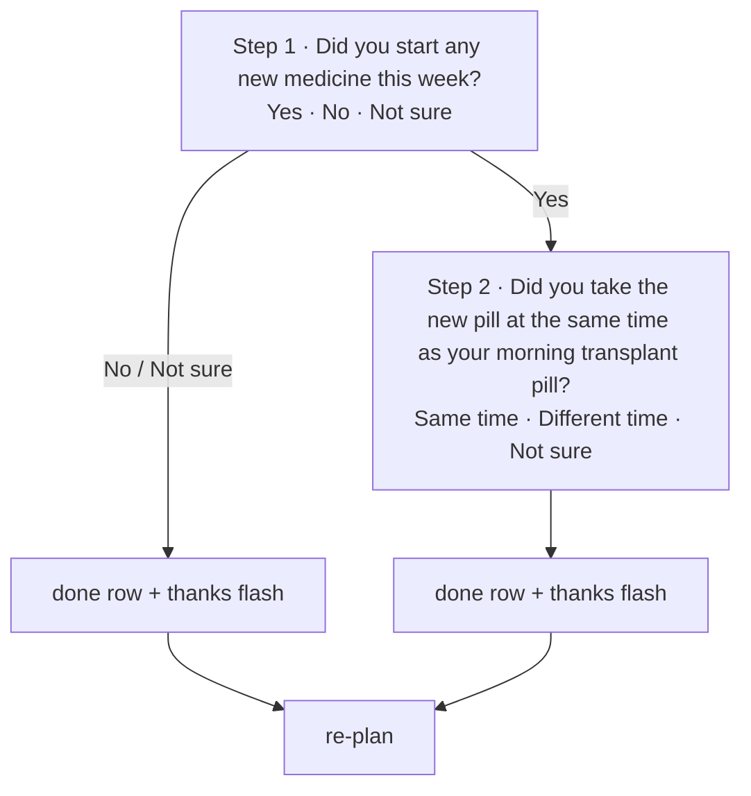

# Workflow 04 — New-medicine watch

> Source: demo scenario `data-sc="newmed"` → new-medicine card, weight **72**, layout `{cols:2, rows:2, tone:'hot'}` in `prototype/phone-app-prototype-v2.html`. Two scripted steps (`newMed.step` 1 → 2), chained from workflow-03's "Yes".

| | |
|---|---|
| **Trigger** | `newMed && newMed.status !== "done"` — either directly (scenario) or seeded by the care-team question answer "Yes" (enters at step 2). |
| **Agent intent** | Complete a two-step interaction watch for the care team: started a new medicine? and if so, was it taken at the same time as the morning transplant pill? |
| **Entry points** | Home planner · workflow-03 "Yes" chain. |
| **Exit / handoff** | `newMed.status = "done"` → done row "New-medicine watch · Answered" + thank-you flash. Answers are flagged for the care team — no advice is given. |

---

## Shared conventions (apply to every agentic workflow)

**Sizing grid** — the home is a 2-column bento grid (82 px row units): `2×N` full-width = the main task; `1×N` half-width = secondary/ambient tiles; 1-row strips = booked events, reminders, done records.

**Tone = importance, never decoration**

| Tone | Class | Use for |
|---|---|---|
| `hot` | `.now` | due right now — gradient border, top of stack |
| `high` | `.t-high` | today's care logistics (booked events, handoffs) |
| `info` | `.t-info` | reminders, FYI strips |
| `game` | `.t-game` | progress, badges, streaks |
| `good` | `.t-good` | thank-you / just-completed confirmations |
| `calm` | — | resting state ("all clear") |
| `done` | `.done` | collapsed record of an answered item |

**Non-negotiable copy rules**
- "Every answer counts the same." — identical chip sizes, zero judgment for any answer (incl. "Not sure").
- The agent never answers clinical questions — it hands off to the care team.
- The agent never invents care tasks or questions — this workflow only runs the care team's scripted watch.
- New tiles animate in staggered (`agent-in`, 45 ms per tile). Respect `prefers-reduced-motion`.

---

## 1. Preconditions (agent knowledge)

**Direct entry (scenario `newmed`):**

```json
{
  "checkins": 31,
  "dose": { "status": "done", "answer": "taken" },
  "newMed": { "status": "waiting", "step": 1 },
  "teamQuestion": null, "temp": { "due": false, "status": "none" },
  "nextSample": { "booked": false, "when": "Sun 11 Oct", "tomorrow": false },
  "handoff": null, "symptoms": [], "vomit": null,
  "reminders": [], "flash": null, "unlock": null
}
```

**Chained entry (from workflow-03 "Yes"):** identical except `newMed = { "status": "waiting", "step": 2 }` — step 1 is skipped because it was just answered.

## 2. Home stack plan

| Priority | Widget | Layout | Tone | Weight |
|---|---|---|---|---|
| 1 | New-medicine question (step 1 `2×2` · step 2 `2×3`) | `2×N` | `hot` | 72 |
| 2 | Badges square → progressText | `1×2` | `game` | 40 (sub) |
| 3 | Care team square → "Call or message" | `1×2` | `calm` | 39 (sub) |

After completion: done row "New-medicine watch · Answered" + thank-you flash (no +1).

## 3. Flow



Step by step:

1. **Step 1** — eyebrow (team icon) `Your care team asks`, headline "Did you start any new medicine this week?", chips **Yes · No · Not sure** in one row (`.answers.three`).
   - No / Not sure → done; watch closes.
   - Yes → `newMed.step = 2`; re-plan swaps the card content in place (same tile slot, `hot`).
2. **Step 2** — eyebrow (pill icon) `Your care team asks`, headline "Did you take the new pill at the same time as your morning transplant pill?", chips **Same time · Different time · Not sure** in a 2-column grid.
3. Any step-2 answer → `newMed.status = "done"`.
4. Done row + flash "Thanks for telling us!" (no +1). The interaction pair (answer + timing) is what the care team reviews.

## 4. Widget specs

- Card: `w compact`, tone `now`; eyebrow icon `i-team` (step 1) / `i-pill` (step 2).
- Layout: step 1 `2×2` (short headline, 3-across chips); step 2 `2×3` — the long timing headline plus a 2-row chip grid needs the extra row unit or the chips spill outside the card.
- Step 1 chips: `.answers.three` (3 across, single row); step 2 chips: `.answers` 2-column grid ("Not sure" takes half width on the second row).
- Headlines are care-team script — reproduced verbatim.
- Done row: check disc + "New-medicine watch" + "Answered".

## 5. State mutations

| Field | After |
|---|---|
| `newMed.step` | `1 → 2` on "Yes" |
| `newMed.status` | `"done"` when step 1 answered No/Not sure, or step 2 answered |
| `flash` | `{ plus: false }` |

## 6. Guardrails

- The agent **never advises on interactions** (no "that's fine", no warnings, no timing suggestions). It records and flags; the care team interprets.
- "Not sure" at either step closes the watch honestly — the user is never forced into a guess.
- Both steps must complete in one sitting where possible (in-place card swap, not a questionnaire).

## 7. CopilotKit mapping

**Shared agent state (`useCoAgent`)**: `newMed`, `flash`.

**Actions (`useCopilotAction`)**

| Action | Args | Render / effect |
|---|---|---|
| `render_new_medicine_start` | — | step-1 card, 3-chip row |
| `render_new_medicine_timing` | — | step-2 card, 2-column chips |
| `answer_new_medicine_start` | `answer: "yes"\|"no"\|"not_sure"` | closes or advances to step 2 |
| `answer_new_medicine_timing` | `answer: "same_time"\|"different_time"\|"not_sure"` | closes watch, done row + flash |

**Generative-UI components**: `NewMedCard` (step-aware), `ThanksCard`, `DoneRow`.
