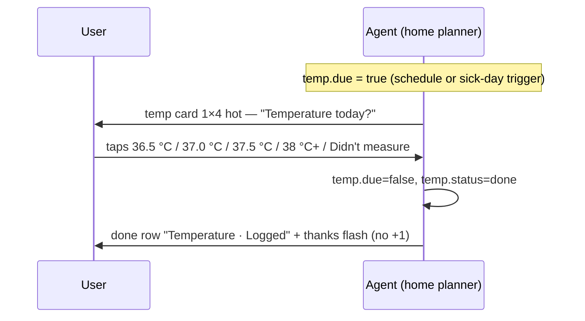

# Workflow 05 — Temperature check

> Source: demo scenario `data-sc="temp"` → temperature card, weight **75**, layout `{cols:1, rows:4, tone:'hot'}`, chips rendered `.answers.col` (single column) in `prototype/phone-app-prototype-v2.html`.

| | |
|---|---|
| **Trigger** | `temp.due === true` — scheduled by the care team, **or** triggered by workflow-08 (sick-day voice notes fever / flu-like). |
| **Agent intent** | Capture one thermometer reading (or an honest "didn't measure") as a full-width-of-column tap, and log it for the care team. |
| **Entry points** | Home planner · workflow-08 hand-off. |
| **Exit / handoff** | `temp.status = "done"` → done row "Temperature · Logged" + thank-you flash. |

---

## Shared conventions (apply to every agentic workflow)

**Sizing grid** — the home is a 2-column bento grid (82 px row units): `2×N` full-width = the main task; `1×N` half-width = secondary/ambient tiles; 1-row strips = booked events, reminders, done records.

**Tone = importance, never decoration**

| Tone | Class | Use for |
|---|---|---|
| `hot` | `.now` | due right now — gradient border, top of stack |
| `high` | `.t-high` | today's care logistics (booked events, handoffs) |
| `info` | `.t-info` | reminders, FYI strips |
| `game` | `.t-game` | progress, badges, streaks |
| `good` | `.t-good` | thank-you / just-completed confirmations |
| `calm` | — | resting state ("all clear") |
| `done` | `.done` | collapsed record of an answered item |

**Non-negotiable copy rules**
- "Every answer counts the same." — identical chip sizes, zero judgment for any answer (incl. "Didn't measure").
- The agent never answers clinical questions — it hands off to the care team.
- The agent never invents care tasks. Nothing due → calm resting card only.
- New tiles animate in staggered (`agent-in`, 45 ms per tile). Respect `prefers-reduced-motion`.

---

## 1. Preconditions (agent knowledge)

```json
{
  "checkins": 31,
  "dose": { "status": "done", "answer": "taken" },
  "temp": { "due": true, "status": "none" },
  "teamQuestion": null, "newMed": null, "handoff": null,
  "symptoms": [], "vomit": null,
  "nextSample": { "booked": false, "when": "Sun 11 Oct", "tomorrow": false },
  "reminders": [], "flash": null, "unlock": null
}
```

## 2. Home stack plan

| Priority | Widget | Layout | Tone | Weight |
|---|---|---|---|---|
| 1 | Temperature question | `1×4` (half-width, tall) | `hot` | 75 |
| 2 | Badges square → progressText | `1×2` | `game` | 40 (sub) |
| 3 | Care team square → "Call or message" | `1×2` | `calm` | 39 (sub) |

**Note the deliberate sizing**: this is the only `hot` tile that is half-width and tall — it sits beside another half-width tile instead of taking the full row. Keep this exact silhouette; it is part of the prototype's planned layout.

After answering: done row "Temperature · Logged" rises to the top; the temp tile disappears.

## 3. Flow



Step by step:

1. Agent renders the card: eyebrow (thermometer icon) `Now · temperature`, headline "Temperature today?"
2. Five chips stacked in a **single column** (`.answers.col`, 42–52 px tall): **36.5 °C · 37.0 °C · 37.5 °C · 38 °C or above · Didn't measure**.
3. Any chip → `temp.due = false`, `temp.status = "done"`, flash set (thanks, no +1).
4. Stack re-plans: done row appears; remaining tiles reflow (the badges square slides up beside where the temp card was).

## 4. Widget specs

- Card: `w compact`, tone `now`, `cols:1 rows:4`; eyebrow icon `i-therm`.
- Chips: `.answers.col` — `grid-template-columns:1fr`, 8 px gap, 13.5 px font. Values are pre-bucketed — **no numeric keypad**, no free-text entry.
- Done row: check disc + "Temperature" + "Logged".

## 5. State mutations

| Field | After |
|---|---|
| `temp.due` | `false` |
| `temp.status` | `"done"` |
| `flash` | `{ plus: false }` — thank-you without check-in increment |

## 6. Guardrails

- The agent **never interprets the reading** — no "that's high", no advice, no triage. A 38 °C+ answer is logged and visible to the care team; escalation is their call.
- "Didn't measure" is treated identically to a reading — same thank-you, no guilt.
- Readings are tap-buckets only; the agent never asks for decimals it can't verify.

## 7. CopilotKit mapping

**Shared agent state (`useCoAgent`)**: `temp`, `flash`.

**Actions (`useCopilotAction`)**

| Action | Args | Render / effect |
|---|---|---|
| `render_temperature_prompt` | `reason: "scheduled" \| "sick_day"` | `1×4 hot` card, single-column chips |
| `answer_temperature` | `value: "36.5"\|"37.0"\|"37.5"\|"38_plus"\|"not_measured"` | closes card, done row + flash |

**Generative-UI components**: `TemperatureCard`, `ThanksCard`, `DoneRow`.
