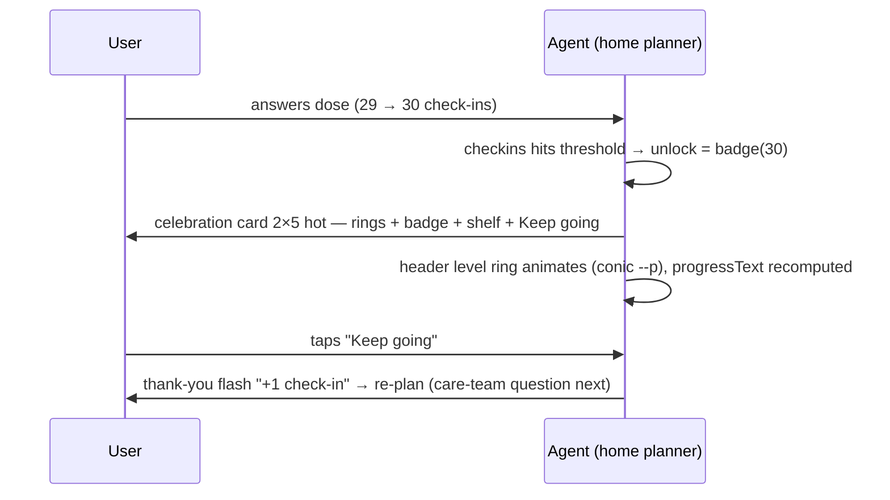

# Workflow 06 — Badge day (check-in milestone unlock)

> Source: demo scenario `data-sc="badge"` → unlock celebration card, weight **99** (highest), layout `{cols:2, rows:5, tone:'hot'}`; flash card weight **90** `{cols:2, rows:2, tone:'good'}`; milestone screen (`renderMilestone`) in `prototype/phone-app-prototype-v2.html`.

| | |
|---|---|
| **Trigger** | A logged dose check-in lands **exactly on** a badge threshold: `checkins ∈ {1, 7, 30, 100, 365}`. Demo: `checkins = 29`, user answers the dose → 30 → "First month". |
| **Agent intent** | Mark the milestone with one unmissable, joyful moment — then get out of the way. |
| **Entry points** | `logDose()` after any dose answer (workflow-01 tap or voice confirm). |
| **Exit / handoff** | User taps **Keep going** → celebration clears → thank-you flash → normal stack re-plan (care-team question becomes the next `hot` tile). |

---

## Shared conventions (apply to every agentic workflow)

**Sizing grid** — the home is a 2-column bento grid (82 px row units): `2×N` full-width = the main task; `1×N` half-width = secondary/ambient tiles; 1-row strips = booked events, reminders, done records.

**Tone = importance, never decoration**

| Tone | Class | Use for |
|---|---|---|
| `hot` | `.now` | due right now — gradient border, top of stack |
| `high` | `.t-high` | today's care logistics (booked events, handoffs) |
| `info` | `.t-info` | reminders, FYI strips |
| `game` | `.t-game` | progress, badges, streaks |
| `good` | `.t-good` | thank-you / just-completed confirmations |
| `calm` | — | resting state ("all clear") |
| `done` | `.done` | collapsed record of an answered item |

**Non-negotiable copy rules**
- "Every answer counts the same." — badges reward **honest** check-ins, any answer, incl. "Missed it".
- The agent never answers clinical questions — it hands off to the care team.
- The agent never invents care tasks. Nothing due → calm resting card only.
- New tiles animate in staggered (`agent-in`, 45 ms per tile). Respect `prefers-reduced-motion`.

---

## 1. Preconditions (agent knowledge)

```json
{
  "checkins": 29,
  "dose": { "status": "due", "answer": null },
  "nextSample": { "booked": false, "when": "Sun 11 Oct", "tomorrow": false },
  "teamQuestion": { "status": "waiting", "text": "Did you start any new medicine this week?" },
  "BADGES": [
    { "n": 1,   "label": "First check-in" },
    { "n": 7,   "label": "First week" },
    { "n": 30,  "label": "First month" },
    { "n": 100, "label": "Hundred club" },
    { "n": 365, "label": "First year" }
  ]
}
```

Badge copy (celebration + milestone hero), identical in both places:
- 1 — "Your first honest check-in. That is a clear picture for your care team."
- 7 — "Seven honest check-ins. That is a clear picture for your care team."
- 30 — "Thirty honest check-ins. That's a clear picture for your care team."
- 100 — "A hundred honest check-ins. That is a clear picture for your care team."
- 365 — "A year of honest check-ins. That is a clear picture for your care team."

## 2. Home stack plan (the moment of unlock)

| Priority | Widget | Layout | Tone | Weight |
|---|---|---|---|---|
| 1 | **Badge celebration** | `2×5` (full-width, tall) | `hot` | 99 — outranks everything |
| 2 | (after dismiss) Thank-you flash "+1 check-in" | `2×2` | `good` | 90 |
| 3 | Care-team question (waiting) | `2×2` | `hot` | 74 |
| 4 | Badges square → progressText now "70 more check-ins to Hundred club" | `1×2` | `game` | 40 (sub) |
| 5 | Care team square | `1×2` | `calm` | 39 (sub) |

**One celebration at a time.** The celebration suppresses the flash card until dismissed (`Keep going`).

## 3. Flow



Step by step:

1. Dose answer lands on the threshold → `unlock` set. The celebration card **jumps the queue** (weight 99 > everything).
2. Celebration card contents, top to bottom:
   - `.celebrate` — badge SVG (gradient ring + big number) wrapped in **two expanding pulse rings** (staggered 0.5 s).
   - Eyebrow (pip): **Badge unlocked**.
   - Headline: **First month · 30 check-ins**.
   - Copy: the badge's line ("Thirty honest check-ins. That's a clear picture for your care team.").
   - **Shelf**: mini badges for 7 / 30 / 100 — earned ones in gradient frames, future ones **grayscale + dimmed (locked)**, each with label and number.
   - Button: **Keep going** (the only way to dismiss).
3. Header updates simultaneously: level ring `--p` animates to the new progress (`(30 % 25)/25`), label **L2**, aria "Level 2, 70 more check-ins to Hundred club".
4. Dismiss → flash card ("Thanks for telling us!" + `+1 check-in` + progress text) → then the normal stack.
5. **Milestone screen** (badges square tap): hero card `.w.now` — if a badge is earned, hero = newest earned badge, eyebrow "Badge unlocked", full colour; if none, hero = next target badge **grayscale**, eyebrow "Your badges", copy "Every honest check-in counts the same." Shelf below; waiting care-team question shows as a row tile.

## 4. Widget specs

- Celebration: `2×5 hot`, centered grid; badge SVG 112 px; `ringpulse` keyframes (scale .8→1.55, fade); `pop` on the badge (scale .55→1.06→1).
- `+1` pill and progress text: sand tones, 13 px Poppins, pill radius.
- Locked badges: `filter:grayscale(1); opacity:.35` — visible but unmistakably not earned.
- All celebration motion must collapse to static under `prefers-reduced-motion: reduce`.

## 5. State mutations

| Field | After |
|---|---|
| `checkins` | threshold value (30 in demo) |
| `unlock` | `{ n, label, copy }` — cleared by "Keep going" |
| `flash` | `{ plus: true }` — revealed after celebration is dismissed |
| Header | level `floor(checkins/25)+1`, ring `--p = (checkins % 25)/25` |

## 6. Guardrails

- Badges reward **honesty**, not adherence: "Missed it" at check-in #30 still unlocks. Never gate rewards on "good" answers.
- **One celebration at a time**; never stack two reward moments.
- Locked badges are always visible (grayscale) — the goal is shown, not hidden.
- Check-ins are never lost or reset; the shelf only ever grows.
- Gamification never outranks care: after "Keep going", the care-team question is the next thing the user sees.

## 7. CopilotKit mapping

**Shared agent state (`useCoAgent`)**: `checkins`, `unlock`, `flash` + derived `level`, `progressText`, `shelf[]`.

**Actions (`useCopilotAction`)**

| Action | Args | Render / effect |
|---|---|---|
| `check_badge_threshold` | `checkins` | returns badge or null (agent logic, not UI) |
| `render_badge_celebration` | `badge: {n,label,copy}`, `shelf` | `2×5 hot` card, pulse rings |
| `dismiss_celebration` | — | clears `unlock`, reveals flash, re-plans |
| `render_badge_shelf` | `earned: number[]` | 7/30/100 mini badges, locked state |
| `update_header_progress` | `level`, `pct` | level ring + aria label |

**Generative-UI components**: `BadgeCelebrationCard`, `BadgeShelf`, `ThanksCard`, `MilestoneHero`, `LevelRing`.
