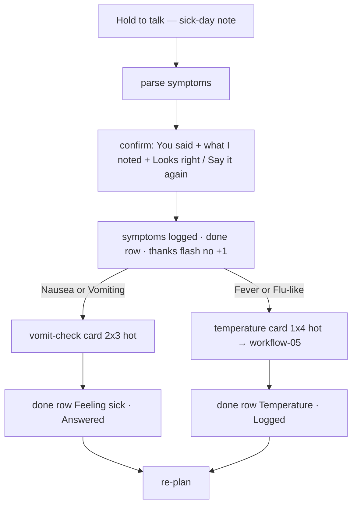

# Workflow 08 — Sick day · voice triage

> Source: demo scenario `data-sc="sick"` → voice result (`voice.type = "sick"`) → symptom logging → chained vomit-check card (weight **76**, `{cols:2, rows:3, tone:'hot'}`) and temperature trigger (→ workflow-05) in `prototype/phone-app-prototype-v2.html`.

| | |
|---|---|
| **Trigger** | User holds the mic FAB and describes feeling unwell — e.g. "I feel nauseous, I've been sleeping most of the morning, and I think I have a fever." |
| **Agent intent** | Turn a spoken sick-day note into structured symptoms (with confirmation), then run the care team's scripted follow-ups **one question at a time**. |
| **Entry points** | Hold-to-talk FAB. |
| **Exit / handoff** | Symptom rows logged; chained questions resolve (vomit check → done row; fever → temperature card → workflow-05); everything visible to the care team. |

---

## Shared conventions (apply to every agentic workflow)

**Sizing grid** — the home is a 2-column bento grid (82 px row units): `2×N` full-width = the main task; `1×N` half-width = secondary/ambient tiles; 1-row strips = booked events, reminders, done records.

**Tone = importance, never decoration**

| Tone | Class | Use for |
|---|---|---|
| `hot` | `.now` | due right now — gradient border, top of stack |
| `high` | `.t-high` | today's care logistics (booked events, handoffs) |
| `info` | `.t-info` | reminders, FYI strips |
| `game` | `.t-game` | progress, badges, streaks |
| `good` | `.t-good` | thank-you / just-completed confirmations |
| `calm` | — | resting state ("all clear") |
| `done` | `.done` | collapsed record of an answered item |

**Non-negotiable copy rules**
- "Every answer counts the same." — identical chip sizes, zero judgment for any answer.
- The agent never answers clinical questions or diagnoses — it records and hands off.
- The agent never invents care tasks. Nothing due → calm resting card only.
- New tiles animate in staggered (`agent-in`, 45 ms per tile). Respect `prefers-reduced-motion`.

---

## 1. Preconditions (agent knowledge)

```json
{
  "checkins": 31,
  "dose": { "status": "done", "answer": "taken" },
  "voice": {
    "type": "sick",
    "said": "I feel nauseous, I've been sleeping most of the morning, and I think I have a fever."
  },
  "symptoms": [], "vomit": null, "temp": { "due": false, "status": "none" },
  "teamQuestion": null, "newMed": null, "handoff": null,
  "nextSample": { "booked": false, "when": "Sun 11 Oct", "tomorrow": false },
  "reminders": [], "flash": null, "unlock": null
}
```

**Symptom parsing rules** (keyword match, case-insensitive):

| Label | Matches |
|---|---|
| Vomiting | vomit, threw up, throwing up, throw up |
| Nausea | nausea, nauseous, queasy, sick to my stomach |
| Fever | fever, burning up, shiver |
| Flu-like | flu, chills |
| Headache | headache, head hurts, migraine |
| Dizzy | dizzy, dizziness, lightheaded, light-headed |
| Stomach upset | diarrhea, diarrhoea, stomach, tummy |
| Tired | tired, exhausted, sleepy, fatigue, slept, sleeping |
| Pain | pain, ache, hurts, hurting, sore |

Demo parse of the sample utterance → **Nausea · Tired · Fever**.

## 2. Stage plan

**Stage A — voice popover (result state)**: "You said" + verbatim transcript · eyebrow (pip) "Here's what I noted" · row **Feeling** → "Nausea · Tired · Fever" with a **Change** affordance · **Looks right** / **Say it again**.

**Stage B — home stack** (after confirm):

| Priority | Widget | Layout | Tone | Weight |
|---|---|---|---|---|
| 1 | Thank-you flash "Thanks for telling us!" (no +1) | `2×2` | `good` | 90 |
| 2 | Vomit-check question (if Nausea/Vomiting) | `2×3` | `hot` | 76 |
| 3 | Temperature question (if Fever/Flu-like) → workflow-05 | `1×4` | `hot` | 75 |
| 4 | Done row "How you feel · Nausea · Tired · Fever" | strip | `done` | 47 |
| 5 | Badges square | `1×2` | `game` | 40 (sub) |
| 6 | Care team square | `1×2` | `calm` | 39 (sub) |

## 3. Flow



Step by step:

1. Hold FAB → listening popover → release → transcript parsed against the symptom rules.
2. Result popover: verbatim quote + "Here's what I noted" (Feeling row). **No commit before confirmation** — speech recognition can mishear; "Say it again" re-records.
3. "Looks right" → close popover, route home:
   - `symptoms = ["Nausea","Tired","Fever"]` → done row "How you feel".
   - Nausea/Vomiting present → `vomit = { status:"waiting" }`.
   - Fever/Flu-like present → `temp.due = true`.
   - Flash `{ plus:false }` — sick-day notes **never** increment check-ins.
4. **Vomit check** (one question at a time): eyebrow (drop icon) `Now · feeling sick`, headline "Did you vomit within an hour of your dose?", chips **Within the hour · Later · Didn't take it** (2-column grid). Any answer → `vomit.status="done"` → done row "Feeling sick · Answered".
5. Temperature card fires next (workflow-05) if triggered.
6. Re-plan; when nothing is left, workflow-09 takes over.

## 4. Widget specs

- Voice result "noted" rows: `.rows` — label (84 px, muted) / bold value / **Change** link (accent); only facts actually parsed appear.
- Vomit-check card: `w compact`, tone `now`, eyebrow `i-drop`; chips 2-column, equal size.
- Done row: check disc + "How you feel" + symptom list joined by " · ".

## 5. State mutations

| Field | After |
|---|---|
| `symptoms` | parsed labels array |
| `vomit` | `{ status:"waiting" }` if Vomiting/Nausea → `"done"` after answer |
| `temp.due` | `true` if Fever/Flu-like |
| `flash` | `{ plus:false }` — **never** `plus:true` here |
| `checkins` | unchanged |

## 6. Guardrails

- **Confirm before commit** — parsed symptoms are shown; nothing is saved until "Looks right".
- The agent **never diagnoses, reassures clinically, or suggests treatment**. It records, asks the scripted follow-ups, and makes the record visible to the care team.
- One question at a time: vomit check and temperature never appear in the same moment if avoidable — the stack order (76 > 75) sequences them.
- If the user sounds severely unwell, the agent's only escalation is the standing offer: **Call your care team** (care-team square / menu). It does not improvise triage.
- No +1, no badge, no gamified celebration on a sick day — rewards stay quiet while the user feels unwell (flash card only).

## 7. CopilotKit mapping

**Shared agent state (`useCoAgent`)**: `voice`, `symptoms`, `vomit`, `temp`, `flash`.

**Actions (`useCopilotAction`)**

| Action | Args | Render / effect |
|---|---|---|
| `parse_symptoms` | `transcript` | runs rules, returns labels |
| `render_voice_result` | `type:"sick"`, `said`, `noted.symptoms` | result popover with Change rows |
| `confirm_symptoms` | `symptoms: string[]` | logs rows, evaluates chain triggers |
| `render_vomit_check` | — | `2×3 hot` card, 3 chips |
| `answer_vomit_check` | `answer: "within_hour"\|"later"\|"didn't_take"` | done row + re-plan |

**Generative-UI components**: `VoiceListeningPop`, `VoiceResultPop` (noted rows), `VomitCheckCard`, `TemperatureCard`, `DoneRow`, `ThanksCard`.
