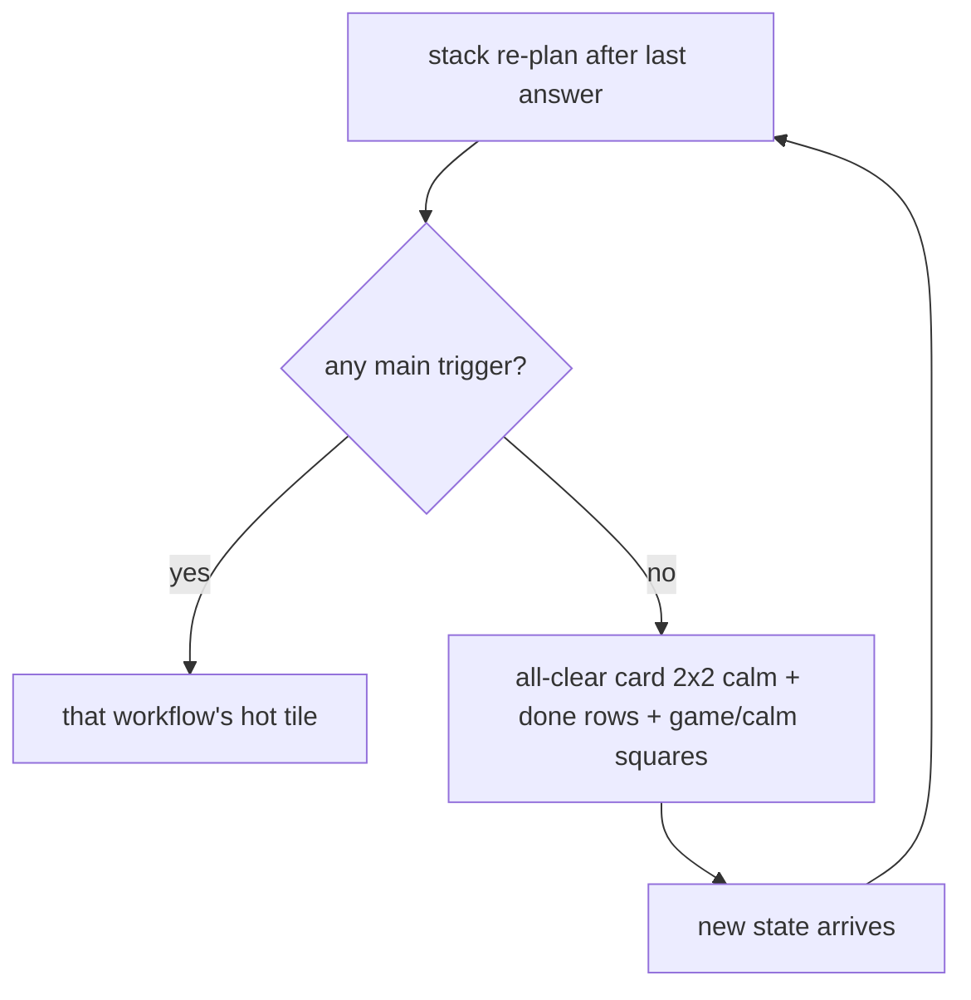

# Workflow 09 — All clear (resting state)

> Source: demo scenario `data-sc="clear"` → fallback card, weight **-1**, layout `{cols:2, rows:2, tone:'calm'}` — the `when()` predicate is the **negation of every other main-tile trigger** in `prototype/phone-app-prototype-v2.html`.

| | |
|---|---|
| **Trigger** | All of: no `flash`, no `unlock`, no `handoff`; `dose.status !== "due"`; **not** (`nextSample.booked && nextSample.tomorrow`); `!temp.due`; no waiting `teamQuestion`; no pending `newMed`; no waiting `vomit`. |
| **Agent intent** | Tell the user, clearly and once, that nothing is owed today — and then stay quiet. The game surface keeps long-term progress visible. |
| **Entry points** | Home planner after the last open item resolves. |
| **Exit / handoff** | Any new state (evening roll-over, care-team question arriving, tomorrow's samples) evicts this card automatically via the planner. |

---

## Shared conventions (apply to every agentic workflow)

**Sizing grid** — the home is a 2-column bento grid (82 px row units): `2×N` full-width = the main task; `1×N` half-width = secondary/ambient tiles; 1-row strips = booked events, reminders, done records.

**Tone = importance, never decoration**

| Tone | Class | Use for |
|---|---|---|
| `hot` | `.now` | due right now — gradient border, top of stack |
| `high` | `.t-high` | today's care logistics (booked events, handoffs) |
| `info` | `.t-info` | reminders, FYI strips |
| `game` | `.t-game` | progress, badges, streaks |
| `good` | `.t-good` | thank-you / just-completed confirmations |
| `calm` | — | resting state ("all clear") |
| `done` | `.done` | collapsed record of an answered item |

**Non-negotiable copy rules**
- "Every answer counts the same." — identical chip sizes, zero judgment for any answer.
- The agent never answers clinical questions — it hands off to the care team.
- **The agent never invents care tasks.** This workflow exists to prove it: no due item → calm resting card only.
- New tiles animate in staggered (`agent-in`, 45 ms per tile). Respect `prefers-reduced-motion`.

---

## 1. Preconditions (agent knowledge)

```json
{
  "checkins": 31,
  "dose": { "status": "done", "answer": "taken" },
  "nextSample": { "booked": false, "when": "Sun 11 Oct", "tomorrow": false },
  "teamQuestion": null, "temp": { "due": false, "status": "none" },
  "newMed": null, "handoff": null, "symptoms": [], "vomit": null,
  "reminders": [], "flash": null, "unlock": null
}
```

## 2. Home stack plan

| Priority | Widget | Layout | Tone | Weight |
|---|---|---|---|---|
| 1 | Done row "Morning dose · Logged" | strip | `done` | 50 |
| 2 | **All-clear card** | `2×2` | `calm` | -1 (fallback — renders only when nothing else can) |
| 3 | Badges square → progressText ("19 more check-ins to First month" etc.) | `1×2` | `game` | 40 (sub) |
| 4 | Care team square → "Call or message" | `1×2` | `calm` | 39 (sub) |

If a future sample is booked (not tomorrow), the `high` strip "Booked by your care team · Sun 11 Oct · Fingerstick samples" also appears above the squares.

## 3. Flow



Step by step:

1. Planner evaluates every main-tile predicate; all false → the fallback card renders **last** in priority but is the only card left.
2. Card contents: eyebrow (pip) **All logged** · headline **"Nothing else is due today"** · line **"Your care team now has the full picture."**
3. Done rows above it preserve the day's record (dose, temperature, team question, feelings, new-medicine watch).
4. The two half-width squares stay: progress (game) and care team (calm) — the resting home is never empty and never dead-ended.
5. The agent does **nothing else**: no nudges, no tips, no filler widgets, no re-asks until state changes.

## 4. Widget specs

- Card: `w compact`, **no tone class** (calm = plain surface, no tint, no gradient border), centered grid.
- Headline is a *relief* statement, not a task: "Nothing else is due today".
- Squares: `sq-tile` with icon chip + eyebrow label + progress/call-to-action text.

## 5. State mutations

| Field | Value |
|---|---|
| Nothing | This workflow mutates nothing — it is a pure function of the state being "clear" |

## 6. Guardrails

- The agent must **not** manufacture engagement: no invented check-ins, no "how are you feeling?" probes once today's items are done, no re-opening answered items.
- Exactly one all-clear card; never combined with a `hot` tile (mutually exclusive by predicate).
- Silence is the feature: this state is how the app earns trust — it asks only when the care plan actually asks.

## 7. CopilotKit mapping

**Shared agent state (`useCoAgent`)**: read-only — the agent derives `allClear` from the negation predicate.

**Actions (`useCopilotAction`)**

| Action | Args | Render / effect |
|---|---|---|
| `render_all_clear` | — | the `2×2 calm` card |
| `render_done_row` | `label`, `status` | day's records |
| `render_progress_square` | `progressText` | badges square (`game`) |
| `render_care_team_square` | — | contact square (`calm`) |

**Generative-UI components**: `AllClearCard`, `DoneRow`, `BadgesSquare`, `CareTeamSquare`.
