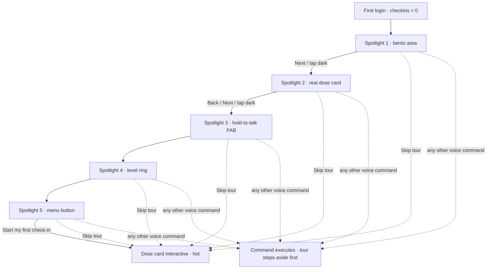

# Workflow 10 — First-time tour ("show me around")

> Source: demo scenario `data-sc="firsttime"` → spotlight layer (`#tour-layer` / `#tour-spot` / `#tour-tip`) with `TOUR_STEPS` + `TOUR_TARGETS`, driven from `renderTour()` inside `AK.plan()` in `prototype/phone-app-prototype-v2.html`.

| | |
|---|---|
| **Trigger** | First successful login (`checkins = 0`, first arrival at home), or on demand — the user asks the agent "show me around" (see **workflow-11-voice-command-routing**). |
| **Agent intent** | Teach the app by **pointing at it**: dim every region under a shadow, spotlight one real UI element at a time, and explain its purpose next to the highlight while the user steps through. |
| **Entry points** | Home after first login (`#/now`) · voice/typed command from any screen. |
| **Exit / handoff** | Dose check-in card becomes interactive (→ **workflow-01-morning-dose**); answering it unlocks the *First check-in* badge (→ **workflow-06-badge-unlock**). |

---

## Shared conventions (apply to every agentic workflow)

**Sizing grid** — the home is a 2-column bento grid (82 px row units): `2×N` full-width = the main task; `1×N` half-width = secondary/ambient tiles; 1-row strips = booked events, reminders, done records.

**Tone = importance, never decoration**

| Tone | Class | Use for |
|---|---|---|
| `hot` | `.now` | due right now — gradient border, top of stack |
| `high` | `.t-high` | today's care logistics (booked events, handoffs) |
| `info` | `.t-info` | reminders, FYI strips |
| `game` | `.t-game` | progress, badges, streaks |
| `good` | `.t-good` | thank-you / just-completed confirmations |
| `calm` | — | resting state ("all clear") |
| `done` | `.done` | collapsed record of an answered item |

**Non-negotiable copy rules**
- "Every answer counts the same." — identical chip sizes, zero judgment for any answer.
- The agent never answers clinical questions — it hands off to the care team.
- The agent never invents care tasks. Nothing due → calm resting card only.
- The spotlight glides between targets (`.3s ease`); respect `prefers-reduced-motion` (no transition).

---

## 1. Preconditions (agent knowledge)

```json
{
  "checkins": 0,
  "dose": { "status": "due", "answer": null },
  "tour": { "active": true, "step": 0, "done": false, "skipped": false },
  "nextSample": { "booked": false, "when": "Sun 11 Oct", "tomorrow": false },
  "teamQuestion": null, "temp": { "due": false, "status": "none" },
  "newMed": null, "symptoms": [], "vomit": null,
  "reminders": [], "flash": null, "unlock": null, "handoff": null
}
```

**Spotlight mode, not focus mode** — the home renders **fully and normally** beneath the overlay (the real dose card is part of the tour); the layer dims everything and makes it non-interactive so the flow stays deterministic.

## 2. The layer

| Piece | Spec |
|---|---|
| `#tour-layer` | absolute overlay over the phone, `z-index 7` (above FAB, below sheets `8–9` and toast `12`); intercepts **all** taps while active |
| `#tour-spot` | transparent cutout over the target rect (`getBoundingClientRect` + padding); dims the rest via `box-shadow: 0 0 0 200vmax rgba(31,50,41,.62)` plus a light ring and soft glow; radius per target (`999px` for round targets); transitions top/left/width/height so the spotlight **glides** between highlights |
| `#tour-tip` | coach-mark card near the spot: eyebrow "Welcome · first time here", headline, purpose line, 5 step dots, controls (`Back` from step 2, `Next` / `Start my first check-in`, `Skip tour`); placed below the spot, else above, clamped to the 390 px phone |

## 3. Highlights per step

| # | Spotlight target | Purpose the tip explains |
|---|---|---|
| 1 | `#agent-stack` (bento area) | This screen is built each morning from what's due — cards sized and shaded by importance; nothing to set up |
| 2 | the real dose card (`#agent-stack .now`) | Check-ins live on cards like this — tap an answer, every answer counts the same |
| 3 | `.fab-wrap` (mic + "Hold to talk" hint) | Hold to talk — you speak, the agent types it out to confirm; you can also type requests |
| 4 | `.lvl` ring in the header | Progress adds up — badges and levels; the ring shows distance to the next one |
| 5 | `.menu` button | Care team one tap away — call/message, and anything the agent can't answer goes to them |

## 4. Flow



Step by step:

1. Agent detects first run (`checkins = 0`) or receives a "show me around" request → layer fades in over the normal home; spot frames the bento area; tip explains it.
2. **Tap the dark region or `Next`** → the spotlight glides to the next real element; the tip follows (below when it fits, otherwise above). `Back` re-visits the previous highlight.
3. Step 2 deliberately spotlights the **actual dose card** sitting in the stack — the tour teaches on the real object the user is about to use.
4. On the last step, dark taps do nothing — only **Start my first check-in** (or **Skip tour**) ends the tour, so the finish is always deliberate.
5. `endTour()` lifts the overlay; the dose card becomes interactive; first answered check-in fires the badge celebration on its own (workflow-06).

## 5. State mutations

| Interaction | Mutation |
|---|---|
| **Next** / tap dark area | `tour.step += 1` → spot + tip glide |
| **Back** | `tour.step -= 1` (not shown on step 1) |
| **Skip tour** | `tour.active = false`, `tour.skipped = true` → layer hides, re-plan |
| **Start my first check-in** | `tour.active = false`, `tour.done = true` → layer hides, re-plan |
| Any other executed voice command during tour | tour steps aside first (`skipped = true`), then the command runs |
| "Show me around" while already touring | no state change — toast "I'm already showing you around" |
| Navigate off `#/now` / load another scenario | layer hides (`renderTour()` guard) |

## 6. Guardrails

- The tour **never blocks care**: `Skip tour` is offered on every step, skipping has no penalty, and the dose card is simply waiting underneath.
- The dimmed UI is **non-interactive** during the tour — no half-committed check-ins while spotlighting; the layer intercepts taps.
- Dark-tap advance is **disabled on the last step** so the finish is always an explicit choice.
- The tour is **replayable** — ask the agent to "show me around" at any time and the spotlight restarts at step 1.
- Copy teaches by pointing at real UI (the stack, the dose card, the FAB, the ring, the menu) — never screenshots, never modals that trap the user.

## 7. CopilotKit mapping

**Shared agent state (`useCoAgent`)**: `tour` (`active`, `step`, `done`, `skipped`), `checkins`, `dose`.

**Actions (`useCopilotAction`)**

| Action | Args | Render / effect |
|---|---|---|
| `start_first_run_tour` | — | sets `tour = {active:true, step:0}`; overlay mounts over the planned home |
| `highlight_element` | `selector`, `padding`, `radius` | positions/glides `#tour-spot` over the real element |
| `render_coach_mark` | `step`, `headline`, `purpose`, `dots`, `controls` | renders `#tour-tip` beside the spotlight |
| `advance_tour` | `dir: "next" \| "back"` | `tour.step ± 1`; spot + tip update |
| `skip_tour` / `complete_tour` | — | `active:false` (+ `skipped`/`done`); overlay unmounts; dose card interactive |

**Generative-UI components**: `TourLayer` (dim cutout + coach-mark card), real home tiles as live props (`DoseCard`, `FabWrap`, `LevelRing`, `MenuButton`).
