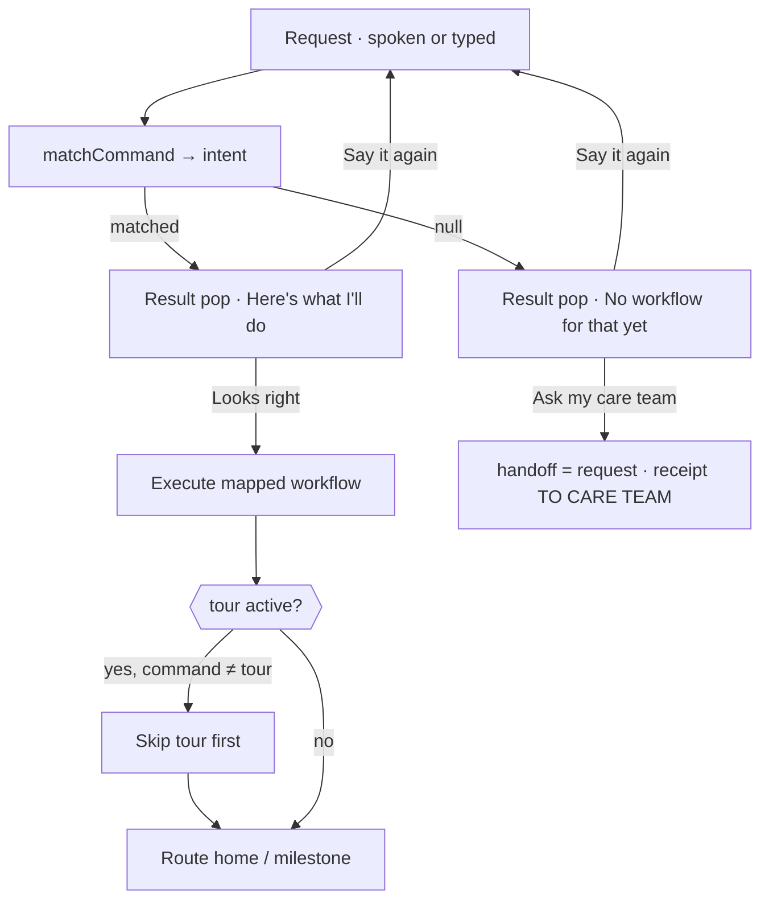

# Workflow 11 — Voice/typed command routing ("any request maps to a workflow")

> Source: listen-pop typed-request input (`#say-input` + `data-say`), `COMMAND_RULES` / `matchCommand()`, the `command` branch of `updateVoicePop()`, and `runCommand()` inside `voiceSubmit()` in `prototype/phone-app-prototype-v2.html`.

| | |
|---|---|
| **Trigger** | The user asks the agent **for an action** instead of answering a check-in — spoken via hold-to-talk, or typed into the "or type a request" field of the listening popover. |
| **Agent intent** | Map every app-related request to **one of the available workflows** and confirm before executing. If no workflow exists, **say so plainly** and offer to ask the care team to add one — never silently drop a request. |
| **Entry points** | Mic FAB popover (listening state) on home or milestone screen. |
| **Exit / handoff** | The mapped workflow executes (workflow-01/02/05/06/10 etc.), or a care-team handoff card is pinned (workflow-07 pattern) requesting a new workflow. |

---

## Shared conventions (apply to every agentic workflow)

**Sizing grid** — the home is a 2-column bento grid (82 px row units): `2×N` full-width = the main task; `1×N` half-width = secondary/ambient tiles; 1-row strips = booked events, reminders, done records.

**Tone = importance, never decoration** — `hot` due now · `high` logistics · `info` reminders · `game` progress · `good` confirmations · `calm` resting · `done` records.

**Non-negotiable copy rules**
- "Every answer counts the same." — identical chip sizes, zero judgment for any answer.
- The agent never answers clinical questions — it hands off to the care team.
- The agent never invents care tasks. Nothing due → calm resting card only.
- New tiles animate in staggered (`agent-in`, 45 ms per tile). Respect `prefers-reduced-motion`.

---

## 1. Preconditions (agent knowledge)

```json
{
  "voice": { "type": "command", "said": "<verbatim request>", "intent": null },
  "tour": { "active": false },
  "dose": { "status": "due | done" },
  "handoff": null
}
```

`intent` is filled by the router: a `{ id, label }` pair from the workflow table below, or `null` when no workflow matches.

## 2. Workflow routing table (`COMMAND_RULES`, evaluated top-down)

| id | Maps to | Example phrases | Regex cues |
|---|---|---|---|
| `tour` | workflow-10 first-time tour | "show me around", "how do I use this app", "start the tour", "get started" | `tour`, `show me round`, `how … use`, `onboard`, `first time` |
| `dose` | workflow-01 morning dose | "log my dose", "took my pill", "my medication" | `dose`, `medication`, `medicine`, `took my pill` |
| `temperature` | workflow-05 temperature check | "log my temperature", "fever check" | `temperature`, `fever check`, `temp` |
| `samples` | workflow-02 evening before samples | "my blood samples", "when do I fast" | `sample`, `blood`, `fingerstick`, `fasting`, `appointment` |
| `badges` | workflow-06 badge unlock | "what's my level", "show my badges" | `badge`, `level`, `progress`, `milestone` |
| `diary` | workflow-12 diary entry | "write in my diary", "note something down", "I want to share something" | `diary`, `journal`, `write/note (it) down`, `share/tell something` |
| `call` | call care team | "call my care team", "speak to someone" | `call`, `phone`, `speak to/with` |
| `message` | workflow-07 handoff | "message my doctor", "I have a question" | `message`, `question`, `ask (my/the) team/doctor/nurse` |
| — | **no workflow** → care-team request | "book me a taxi" | none of the above |

## 3. Stage plan

**Stage A — listening popover** (`listen-pop`): wave bars · **Release to send** · privacy line · divider "or type a request" · text field + **Send** (Enter submits too). Submitting typed text classifies immediately and jumps to the result state.

**Stage B — result popover** (two variants, both show the request **verbatim** under "You said"):

| Variant | Contents | Buttons |
|---|---|---|
| Matched | eyebrow "Here's what I'll do" · row `Workflow → <label>` | **Looks right** (executes) · **Say it again** (ghost) |
| No workflow | eyebrow "No workflow for that yet" · "I don't have a workflow for that. I can ask your care team to add one for you." | **Ask my care team** (executes handoff) · **Say it again** (ghost) |

Nothing executes before the user confirms. The confirm button names its consequence, not just "OK".

## 4. Flow



Step by step:

1. Request is captured **verbatim** (`voice.said`); the classifier returns at most one workflow (first matching rule wins).
2. Result popover: the agent states what it will do (`Workflow → <label>`), or states plainly that no workflow exists.
3. On confirm, the executor routes: `tour` → start/replay tour (or toast "I'm already showing you around"); `dose`/`temperature` → reveal the due card or toast it's already logged/not due; `samples` → booked-info toast; `badges` → milestone screen; `call` → "Demo — no call placed"; `message` → handoff card with the verbatim request; `diary` → workflow-12 (toast "Hold to talk or type — I'll save it as a diary entry").
4. No workflow → the request itself becomes the handoff: `handoff = { q: "Please add a workflow for: “<said>”" }` + toast "Asked your care team to add that workflow". The care team can then add the workflow for this user (doctor-side).
5. While the first-time tour is active (workflow-10), any executed command other than `tour` first steps the tour aside; a `no workflow` request does the same so the handoff card is visible.

## 5. State mutations

| Interaction | Mutation |
|---|---|
| Send / release | `voice = { type:"command", said, intent: <rule \| null> }` |
| **Looks right** (matched) | executor runs; `voice` kept for the inspector record |
| **Ask my care team** (no match) | `handoff = { q: "Please add a workflow for: …" }` → handoff card pins |
| **Say it again** | back to listening state; nothing committed |
| Inspector | `Voice request` row shows the matched workflow id, or `no workflow → care team` |

## 6. Guardrails

- **Confirm-before-act**: execution only on "Looks right"; the transcript is shown verbatim and never paraphrased or edited.
- **Honest refusal**: an unmappable request gets an explicit "I don't have a workflow for that" — the agent never guesses, fakes an action, or stays silent.
- **Escalation path**: every refused request converts into a care-team handoff so the missing workflow can be added for this user.
- **Clinical boundary**: anything that smells like advice ("can I take…") keeps flowing to workflow-07's human handoff, never to an answer.
- Privacy line stays while listening: "Only the words are kept. The voice itself is never analysed."

## 7. CopilotKit mapping

**Shared agent state (`useCoAgent`)**: `voice` (`type:"command"`, `said`, `intent`), `handoff`, `tour.active` (interaction rule with workflow-10).

**Actions (`useCopilotAction`)**

| Action | Args | Render / effect |
|---|---|---|
| `classify_app_request` | `transcript` | returns `{ id, label } \| null` → picks result variant |
| `render_command_result` | `said`, `intent` | result popover: workflow preview or no-workflow notice |
| `execute_workflow` | `id` | routes to the mapped workflow (tour, dose, temp, samples, badges, call, message) |
| `request_new_workflow` | `q` | sets `handoff`, pins the request card for the care team/doctor |

**Generative-UI components**: `VoiceListeningPop` (+ `TypedRequestRow`), `CommandResultPop` (matched / no-workflow variants), `HandoffCard`, `ReceiptStrip`.
