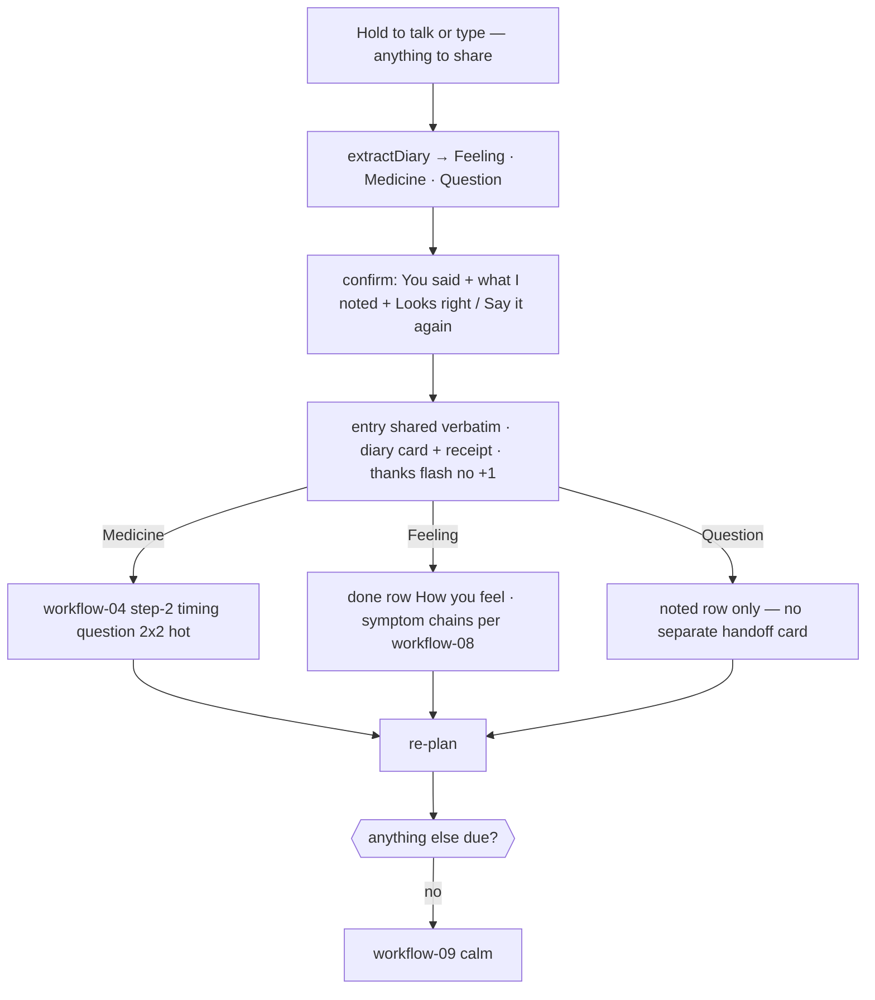

# Workflow 12 — Diary entry ("share anything")

> Source: demo scenario `data-sc="diary"` → voice result (`voice.type = "diary"`) → diary shared card, weight **69**, layout `{cols:2, rows:3, tone:'high'}` in `prototype/phone-app-prototype-v2.html`.

| | |
|---|---|
| **Trigger** | The user shares anything — how their days have been, something that happened, a worry. Spoken via hold-to-talk, or typed into the listening popover; workflow-11 routes "diary / journal / write it down / share something" here. |
| **Agent intent** | Keep the entry in the patient's own words, confirm what was extracted, share it **verbatim** with the care team, and generate only the **existing scripted** follow-up widgets the entry clearly calls for. |
| **Entry points** | Hold-to-talk FAB · typed request in the listening popover. |
| **Exit / handoff** | Diary card pinned (`high` tone) with receipt "Shared with your care team"; chained widgets resolve through their own workflows (04, 08); the entry waits on the Clinic Board as a tier-2 review card. |

---

## Shared conventions (apply to every agentic workflow)

**Sizing grid** — the home is a 2-column bento grid (82 px row units): `2×N` full-width = the main task; `1×N` half-width = secondary/ambient tiles; 1-row strips = booked events, reminders, done records.

**Tone = importance, never decoration**

| Tone | Class | Use for |
|---|---|---|
| `hot` | `.now` | due right now — gradient border, top of stack |
| `high` | `.t-high` | today's care logistics (booked events, handoffs) |
| `info` | `.t-info` | reminders, FYI strips |
| `game` | `.t-game` | progress, badges, streaks |
| `good` | `.t-good` | thank-you / just-completed confirmations |
| `calm` | — | resting state ("all clear") |
| `done` | `.done` | collapsed record of an answered item |

**Non-negotiable copy rules**
- "Every answer counts the same." — identical chip sizes, zero judgment for any answer.
- The agent never answers clinical questions and never reacts clinically to a diary entry — it records, confirms, relays.
- The agent never invents care tasks or questions — chained widgets are existing care-team scripted follow-ups only.
- New tiles animate in staggered (`agent-in`, 45 ms per tile). Respect `prefers-reduced-motion`.

---

## 1. Preconditions (agent knowledge)

```json
{
  "checkins": 31,
  "dose": { "status": "done", "answer": "taken" },
  "voice": {
    "type": "diary",
    "said": "It's been a rough couple of days. I felt dizzy after my morning pill on Tuesday, I started taking a herbal supplement my friend gave me, and I haven't been sleeping well."
  },
  "diary": null, "newMed": null, "handoff": null,
  "symptoms": [], "vomit": null, "temp": { "due": false, "status": "none" },
  "teamQuestion": null,
  "nextSample": { "booked": false, "when": "Sun 11 Oct", "tomorrow": false },
  "reminders": [], "flash": null, "unlock": null
}
```

**Theme extraction rules** (`extractDiary`, evaluated on the verbatim transcript):

| Theme | Noted row | Matches | On confirm |
|---|---|---|---|
| Feeling | `Feeling` | reuses the workflow-08 symptom rules (vomit, nausea, fever, flu, headache, dizzy, stomach, tired, pain) | union into `symptoms` → done row "How you feel"; vomit/fever chains per workflow-08 |
| Medicine | `Medicine` | `supplement`, `started taking`, `been taking`, `herbal`, `new medicine/medication/pill/tablet/antibiotic` | seeds workflow-04 **at step 2** (timing question) |
| Question | `Question` | `should i`, `can i`, `do you think`, `wondering if/whether` | flagged in the noted rows only — it rides to the care team **with the entry itself** (§6) |

Demo parse of the sample entry → **Feeling: Dizzy · Tired** (`sleeping` → Tired), **Medicine: started a supplement**, no question.

## 2. Stage plan

**Stage A — voice popover (result state)**: "You said" + verbatim transcript · eyebrow (pip) "Here's what I noted" · `.rows` for each extracted theme (label / bold value / **Change** — only what was actually parsed appears) · **Looks right** / **Say it again**. No commit before confirmation.

**Stage B — home stack** (after confirm):

| Priority | Widget | Layout | Tone | Weight |
|---|---|---|---|---|
| 1 | Thank-you flash "Thanks for telling us!" (**no +1**) | `2×2` | `good` | 90 |
| 2 | New-pill timing question (if Medicine noted) → workflow-04 | `2×3` | `hot` | 72 |
| 3 | Diary shared card (verbatim quote + receipt) | `2×3` | `high` | 69 |
| 4 | Done row "How you feel · Dizzy · Tired" (if Feeling noted) | strip | `done` | 47 |
| 5 | Done row "Diary entry · Shared" | strip | `done` | 43 |
| 6 | Badges square | `1×2` | `game` | 40 (sub) |
| 7 | Care team square | `1×2` | `calm` | 39 (sub) |

The calm "all clear" card is suppressed while the diary card is pinned.

## 3. Flow



Step by step:

1. Capture the entry **verbatim** (`voice.said`); run `extractDiary` over it. A transcript that reads as a question or a command still routes to workflow-07/11 — only personal shares become diary entries.
2. Result popover: verbatim quote under "You said", plus "Here's what I noted" rows for parsed themes only. **No commit before confirmation**; "Say it again" re-records.
3. "Looks right" → `diary = { status:"shared", text, noted }`; symptoms union; `newMed = { status:"waiting", step:2 }` if a medicine/supplement was noted; `flash = { plus:false }`.
4. The diary card renders pinned: eyebrow **Your diary** · the entry as a pull-quote · receipt "Shared with your care team · just now" + tag `DIARY`.
5. Chained cards resolve through their own workflows (04 timing answer, 08 symptom chains). Re-plan; when nothing is left, workflow-09 takes over.

## 4. Widget specs

- Popover noted rows: `.rows` — label (84 px, muted) / bold value / **Change** link (accent); only facts actually parsed appear.
- Diary shared card: `w compact`, tone `high`; `.say` pull-quote (ink, 17 px); `.rcpt` receipt with gradient-check icon and uppercase em tag `DIARY`.
- Done rows: check disc + label + status word, per existing `.done` pattern.

### Doctor side — Clinic Board (spec; reference boards not yet updated)

A diary entry **never** creates a tier-1 decision and never triggers the escalation gate — escalation stays with deterministic Python.

| Element | Spec |
|---|---|
| Card | Tier-2 (`t2`, violet-diamond chip **"Needs review"**) in the triage frame; collapses to a tier-3 done line after review |
| Title | "Elena shared a diary entry · Sat 10 Oct" · thin context "her words, verbatim" |
| Focus | The entry as a verbatim quote (gradient underline on the patient's own key phrases only — the agent highlights nothing it inferred) |
| Context lines | "Noted by agent: Dizzy · Tired · new supplement" — typed labels only, labelled as extraction, never as interpretation |
| Links | Deep-links to data already on the board (symptom rows, med-watch answer, temperature) — never new numbers |
| Actions | **Send a question** (opens the §5F approval flow — the draft reaches Elena only after Send/Edit) · **Mark reviewed** → tier-3 done line "You reviewed Elena's diary entry" |
| Sources | "Diary: patient entry, <time>" — the entry itself is the source |

## 5. State mutations

| Field | After |
|---|---|
| `voice` | `{ type:"diary", said, noted }` — kept for the inspector record |
| `diary` | `{ status:"shared", text, noted }` — pins the shared card; blocks the calm card |
| `symptoms` | union with noted Feeling labels |
| `newMed` | `{ status:"waiting", step:2 }` **only if** Medicine noted |
| `flash` | `{ plus:false }` — diary entries are **never** check-ins |
| `checkins` | unchanged |

## 6. Guardrails

- **Verbatim relay** — the entry reaches the care team exactly as written; the agent only extracts typed labels, and only ones the patient confirms ("Looks right").
- **No clinical reaction** — "rough couple of days" gets warmth, never interpretation, reassurance, or advice. The agent does not summarize or paraphrase the entry out of existence.
- **Chain, don't author** — the only widgets the entry can generate are existing care-team scripted follow-ups (workflow-04 step 2, workflow-08 chains). The agent never writes a new question from diary content.
- **Questions ride with the entry** — a "should I…?" inside a diary entry is flagged in the noted rows and delivered with the entry itself; no duplicate handoff card is pinned (unlike workflow-07, where the question is the whole payload).
- **No rewards** — no +1, no badge, no celebration for a diary entry (gamification rule 1: only dose check-ins count). Thanks flash only.
- **Voluntary and unscheduled** — the agent never prompts, nudges, or schedules diary entries. No entry → no diary widgets, calm card only.
- **Privacy line** stays while listening: "Only the words are kept. The voice itself is never analysed."
- **Doctor side stays quiet until read** — the entry lands as tier-2 review, never as an urgent alert; "Send a question" drafts never render in the patient app unapproved (§3.6 of AGENTS.md).

## 7. CopilotKit mapping

**Shared agent state (`useCoAgent`)**: `voice` (`type:"diary"`, `said`, `noted`), `diary`, `symptoms`, `newMed`, `flash`.

**Actions (`useCopilotAction`)**

| Action | Args | Render / effect |
|---|---|---|
| `classify_voice_note` | `transcript` | now also returns `type: "diary"` → routes this workflow |
| `extract_diary_themes` | `transcript` | returns `{ symptoms[], medicine, question }` — typed labels only |
| `render_diary_result` | `said`, `noted` | result popover: verbatim quote + noted rows + confirm/re-record |
| `confirm_diary_entry` | `noted` | commits: sets `diary`, unions symptoms, seeds chained widgets, receipt |
| `share_diary_entry` | `text` | pins the diary card, renders receipt `TO CARE TEAM` (Clinic Board: tier-2 review card) |
| *(chained)* `answer_new_medicine_timing`, workflow-08 actions | — | resolve via their own workflows |

**Generative-UI components**: `DiaryResultPop` (VoiceResultPop diary variant), `DiarySharedCard`, `DiaryDoneRow`, plus existing chained components.
