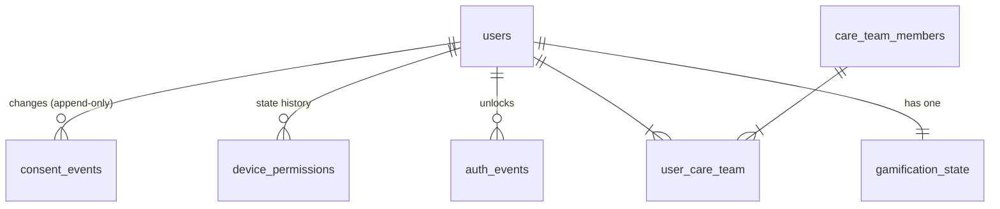
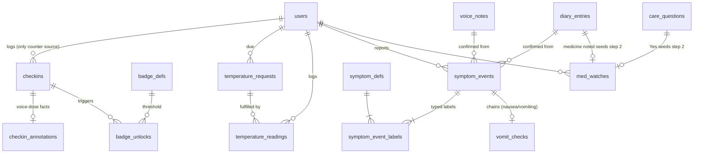
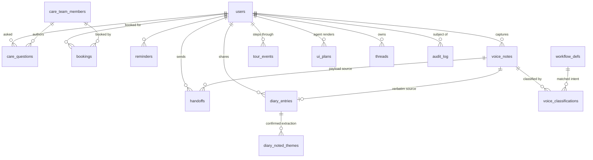

# Agentic Kinetic — Data Model (Postgres 16)

> Source of truth for every stored field: the 13 agentic workflows (`../agentic workflows/workflow-00…12.md`, `gamification-guidelines.md`) and the prototype state machine (`../prototype/phone-app-prototype-v2.html`). Column-level derivation from each workflow's "State mutations" tables; lifecycle rules from `architecture-design.md` §7.
>
> Decisions baked into this model:
> **(1)** free text stays as verbatim columns on its domain table — no central text store;
> **(2)** time series = plain `timestamptz` fields on append-only event tables — no partitioning, no TimescaleDB;
> **(3)** no vector storage — embeddings/vector DB explicitly out of scope for now;
> **(4)** categories = native Postgres enums (closed sets) + small catalog tables (extensible sets);
> **(5)** numerical data lives in dedicated numeric columns/tables, never packed into text or jsonb.

---

## 1. Modality split — where each kind of data lives

| Modality | Storage rule | Examples |
|---|---|---|
| **Text (verbatim)** | `TEXT NOT NULL` column on the domain table that owns it. Marked **verbatim** — rendered byte-identical, never paraphrased, edited, or "improved" by the agent. | `care_questions.text`, `handoffs.q`, `diary_entries.text`, `voice_notes.transcript` |
| **Text (label/copy)** | `TEXT` on catalog tables, versioned by the catalog, never per-row. | `badge_defs.copy`, `symptom_defs.label` |
| **Categories** | Postgres enum types for closed sets; catalog tables (`*_defs`) for sets the care team may extend. | `dose_answer`, `temp_bucket`, `symptom_defs`, `workflow_defs` |
| **Time series** | Append-only event tables with `*_at timestamptz` (+ `(user_id, ts)` index). Rows are never mutated except to fill a nullable "resolved" column (`answered_at`, `delivered_at`, …). | `checkins`, `temperature_readings`, `symptom_events`, `tour_events` |
| **Numerical** | Dedicated typed columns (`int`, `numeric(3,1)`, `smallint`) on their owning table; counters on one state table. | `gamification_state.checkins`, `checkin_annotations.minutes_dose_to_meal`, `temperature_readings.numeric_c`, `voice_classifications.confidence` |
| **Structured previews** | `jsonb` only for pre-confirmation agent output and agent plan audit — never for confirmed facts. Confirmed facts always get their own typed rows. | `voice_notes.noted`, `ui_plans.plan` |
| **Vectors** | **Not stored.** No embeddings table, no pgvector. If semantic routing / similar-diary search becomes a requirement later, add an isolated sidecar (pgvector table or external vector DB) keyed by `voice_notes.id` / `diary_entries.id` — the core schema below requires no change. | — |

Anti-patterns this split forbids:

- no `text[]` for symptom labels → M:N join table (`symptom_event_labels`)
- no jsonb blob for diary "noted" themes → `diary_noted_themes` rows
- no enum answer stored as display string → enum codes (`not_sure`, not "Not sure")
- no mutable "current status" row that overwrites history → append-only events + nullable resolution columns

---

## 2. Entity–relationship diagrams

### 2.1 Identity, consent, care team

### 2.2 Care time series (workflows 01, 04, 05, 08)

### 2.3 Care-team content, voice pipeline, agent (workflows 02, 03, 07, 09–12)

---

## 3. Table reference

Conventions: PK `uuid DEFAULT gen_random_uuid()` unless noted; `bigserial` for high-volume append-only logs. All timestamps `timestamptz NOT NULL DEFAULT now()`. Every client-written event carries `client_event_id TEXT UNIQUE NOT NULL` for offline-queue dedup (§5.2).

### 3.1 Identity, consent, device — workflow-00

**`users`**

| Column | Type | Notes |
|---|---|---|
| id | uuid PK | |
| auth0_sub | text UNIQUE NOT NULL | Auth0 subject |
| display_name | text NOT NULL | "Elena" |
| language | text NOT NULL DEFAULT 'en' | |
| timezone | text NOT NULL | drives `daypart` computation (morning/evening) |
| registered_at | timestamptz NULL | set on first arrival at home (`registered = true`) |
| created_at | timestamptz | |

**`consent_events`** — append-only audit ("changing your mind is always recorded"). Current state = latest row per scope.

| Column | Type | Notes |
|---|---|---|
| id | bigserial PK | |
| user_id | uuid FK users NOT NULL | |
| scope | consent_scope NOT NULL | `own_care \| deidentified_research \| named_research` |
| state | consent_state NOT NULL | `always_on \| on \| off \| not_offered` |
| actor | actor_type NOT NULL | `system` seeds own_care=always_on; `user` flips the toggle |
| changed_at | timestamptz | |

**`device_permissions`** — append-only state history (latest row = current). Permissions are re-prompted just-in-time when `ask`.

| Column | Type | Notes |
|---|---|---|
| id | bigserial PK | |
| user_id | uuid FK users NOT NULL | |
| permission | permission_kind NOT NULL | `microphone \| notifications` |
| state | permission_state NOT NULL | `ask \| granted \| soft_declined` — "Not now" = `ask`, never blocks care |
| changed_at | timestamptz | |

**`auth_events`**

| Column | Type | Notes |
|---|---|---|
| id | bigserial PK | |
| user_id | uuid FK users NOT NULL | |
| method | auth_method NOT NULL | `face_id \| passcode` |
| at | timestamptz | |

**`care_team_members`**, **`user_care_team`**

| Table | Columns |
|---|---|
| care_team_members | id uuid PK · display_name text · role text (`clinician\|nurse\|coordinator`) · phone text NULL · created_at |
| user_care_team | user_id FK · member_id FK · PK (user_id, member_id) |

### 3.2 Catalogs — categorical reference data

**`badge_defs`** — thresholds are exact and immutable (gamification rule 6: never retroactively change).

| Column | Type | Notes |
|---|---|---|
| n | int PK | 1 · 7 · 30 · 100 · 365 |
| label | text NOT NULL | First check-in · First week · First month · Hundred club · First year |
| copy | text NOT NULL | celebration line, identical on card and milestone hero |

**`symptom_defs`** — the workflow-08 parsing rules, one row per typed label.

| Column | Type | Notes |
|---|---|---|
| code | text PK | `vomiting · nausea · fever · flu_like · headache · dizzy · stomach_upset · tired · pain` |
| label | text NOT NULL | display: Vomiting · Nausea · Fever · Flu-like · … |
| keywords | text[] NOT NULL | match list, e.g. `{'vomit','threw up','throwing up','throw up'}` |

**`workflow_defs`** — the workflow-11 routing table (`COMMAND_RULES`).

| Column | Type | Notes |
|---|---|---|
| id | text PK | `tour · dose · temperature · samples · badges · diary · call · message` |
| label | text NOT NULL | "Show me around · first-time tour", "Log your dose", … |
| maps_to | text NULL | workflow doc id (`wf-01`…) — NULL for `call` (dialer action) |
| match_pattern | text NULL | regex cue, first-match-wins ordering via `priority int` |

| Column (cont.) | Type | Notes |
|---|---|---|
| priority | int NOT NULL | evaluation order, top-down |

### 3.3 Check-ins — workflow-01 (the only counter source)

**`checkins`** — append-only time series. **Only `POST /me/checkins` (an insert here) increments `gamification_state.checkins`** — the single honest metric.

| Column | Type | Notes |
|---|---|---|
| id | uuid PK | |
| user_id | uuid FK users NOT NULL | |
| kind | checkin_kind NOT NULL DEFAULT 'dose' | only `dose` exists today; enum reserves the name |
| answer | dose_answer NOT NULL | `taken \| late \| missed \| not_sure` — all four are first-class, identical weight |
| channel | checkin_channel NOT NULL | `chip \| notification_action \| voice` — home tap / lock-screen chip / voice confirm |
| dose_at | timestamptz NOT NULL | the dose the answer refers to (recomputed from event time when offline queue syncs) |
| logged_at | timestamptz | when the server accepted it |
| client_event_id | text UNIQUE NOT NULL | offline dedup |
| voice_note_id | uuid FK voice_notes NULL | set when channel = voice |

Index: `(user_id, logged_at DESC)`.

**`checkin_annotations`** — the "Here's what I noted" facts from a voice dose note (workflow-01b: "Late · about 11:00 / After breakfast / Typical day? Yes"). One-to-one, only exists for voice check-ins.

| Column | Type | Notes |
|---|---|---|
| checkin_id | uuid PK/FK checkins | |
| noted_time | time NULL | "about 11:00" |
| food_relation | text NULL | "after breakfast" — free label from the parse |
| minutes_dose_to_meal | int NULL | numerical distance dose → meal |
| meal_size_vs_usual | text NULL | smaller / same / larger (label; constrain later) |
| typical_day | bool NULL | |

### 3.4 Temperature — workflows 05, 08

**`temperature_requests`** — persists the `temp.due` state. Created by the scheduler (care-team plan) or by a confirmed sick note (Fever/Flu-like chain).

| Column | Type | Notes |
|---|---|---|
| id | uuid PK | |
| user_id | uuid FK users NOT NULL | |
| reason | temp_reason NOT NULL | `scheduled \| sick_day` |
| source_symptom_event_id | uuid FK symptom_events NULL | set when reason = sick_day |
| requested_at | timestamptz | |
| fulfilled_at | timestamptz NULL | set when the reading lands |
| cancelled_at | timestamptz NULL | |

**`temperature_readings`** — append-only time series. Tap-buckets only; no keypad, no decimals the agent can't verify.

| Column | Type | Notes |
|---|---|---|
| id | uuid PK | |
| user_id | uuid FK users NOT NULL | |
| bucket | temp_bucket NOT NULL | `v36_5 \| v37_0 \| v37_5 \| v38_plus \| not_measured` — "Didn't measure" is a first-class answer |
| numeric_c | numeric(3,1) NULL | derived bridge to numerical: 36.5 / 37.0 / 37.5 / 38.0; NULL for `not_measured` |
| reason | temp_reason NOT NULL | copied from the request (or direct) |
| request_id | uuid FK temperature_requests NULL | |
| taken_at | timestamptz NOT NULL | |
| logged_at | timestamptz | |
| client_event_id | text UNIQUE NOT NULL | |

Never increments check-ins. The agent never interprets the reading — escalation is clinician-side.

### 3.5 Symptoms & vomit check — workflows 08, 12

**`symptom_events`** — one row per confirmed "How you feel" report (sick note or diary Feeling theme). Nothing is saved before "Looks right".

| Column | Type | Notes |
|---|---|---|
| id | uuid PK | |
| user_id | uuid FK users NOT NULL | |
| source | symptom_source NOT NULL | `sick_note \| diary` |
| voice_note_id | uuid FK voice_notes NULL | |
| diary_entry_id | uuid FK diary_entries NULL | |
| event_at | timestamptz NOT NULL | when the user said it |
| confirmed_at | timestamptz NOT NULL | "Looks right" commit |
| client_event_id | text UNIQUE NOT NULL | |

**`symptom_event_labels`** — the M:N split (no `text[]` on the event).

| Column | Type | Notes |
|---|---|---|
| symptom_event_id | uuid FK PK | |
| symptom_code | text FK symptom_defs PK | |
| confirmed | bool NOT NULL DEFAULT true | "Change" affordance edits before commit |

**`vomit_checks`** — the scripted follow-up, one question at a time. Chain trigger: Nausea or Vomiting present.

| Column | Type | Notes |
|---|---|---|
| id | uuid PK | |
| user_id | uuid FK users NOT NULL | |
| source_symptom_event_id | uuid FK symptom_events NOT NULL | |
| answer | vomit_answer NULL | `within_hour \| later \| didnt_take` — NULL until answered |
| asked_at | timestamptz NOT NULL | |
| answered_at | timestamptz NULL | |
| stale_after | timestamptz NOT NULL | asked_at + 24h; stale marks are clinician-side only |

### 3.6 Care-team authored content — workflows 02, 03

**`care_questions`** — authored by clinicians, reproduced verbatim; the agent is messenger, never author. A draft never renders as booked (monitoring-25 #14).

| Column | Type | Notes |
|---|---|---|
| id | uuid PK | |
| user_id | uuid FK users NOT NULL | |
| text | TEXT NOT NULL | **verbatim** — "Did you start any new medicine this week?" |
| author_id | uuid FK care_team_members NOT NULL | |
| status | care_question_status NOT NULL | `draft → approved → waiting → answered` |
| approved_at | timestamptz NULL | clinician approval |
| sent_at | timestamptz NULL | became visible (waiting) |
| answer | ternary NULL | `yes \| no \| not_sure` |
| answered_at | timestamptz NULL | |
| created_at | timestamptz | |

Answer `yes` seeds a `med_watches` row at step 2 inside the same transaction.

**`bookings`** — care-team-booked sample days (workflow-02). The agent never re-books, reschedules, or edits.

| Column | Type | Notes |
|---|---|---|
| id | uuid PK | |
| user_id | uuid FK users NOT NULL | |
| test_name | text NOT NULL | "Fingerstick samples" |
| for_date | date NOT NULL | |
| fasting | bool NOT NULL DEFAULT false | repeated verbatim, never improvised |
| timeline_offsets_h | int[] NOT NULL | `{0, 1, 3, 6}` — Before dose / 1 h / 3 h / 6 h |
| booked_by | uuid FK care_team_members NOT NULL | |
| created_at | timestamptz | |

`nextSample.tomorrow` is derived: `for_date = current_date + 1`.

**`reminders`** — scheduler sweep output (architecture §8), rendered as `info` strips.

| Column | Type | Notes |
|---|---|---|
| id | uuid PK | |
| user_id | uuid FK users NOT NULL | |
| kind | reminder_kind NOT NULL | `night_before_prep \| checkin_nudge \| booking_reminder` |
| text | text NOT NULL | "Keep your thermometer by the bed tonight" |
| fire_at | timestamptz NOT NULL | |
| delivered_at | timestamptz NULL | device confirmed local notification fired |
| acked_at | timestamptz NULL | strip tap |
| notif_id | text NULL | notifee local-notification id |
| created_at | timestamptz | |

### 3.7 Handoffs & med watch — workflows 04, 07, 11

**`handoffs`** — verbatim questions/requests routed to the human care team. Card stays pinned until a reply lands in its place.

| Column | Type | Notes |
|---|---|---|
| id | uuid PK | |
| user_id | uuid FK users NOT NULL | |
| kind | handoff_kind NOT NULL | `question \| workflow_request` |
| q | TEXT NOT NULL | **verbatim** — the transcript, or "Please add a workflow for: …" (workflow-11 no-match) |
| voice_note_id | uuid FK voice_notes NULL | |
| status | handoff_status NOT NULL DEFAULT 'sent' | `sent \| answered` |
| reply_text | text NULL | care-team reply renders in the same card |
| replied_at | timestamptz NULL | |
| client_event_id | text UNIQUE NOT NULL | |
| created_at | timestamptz | |

**`med_watches`** — the two-step care-team scripted watch (workflow-04). Seeded by care-question "Yes" (step 2) or a diary Medicine theme (step 2), or created fresh at step 1.

| Column | Type | Notes |
|---|---|---|
| id | uuid PK | |
| user_id | uuid FK users NOT NULL | |
| seeded_by_question_id | uuid FK care_questions NULL | |
| seeded_by_diary_id | uuid FK diary_entries NULL | |
| step | smallint NOT NULL DEFAULT 1 | 1 = started-new-medicine · 2 = timing |
| start_answer | ternary NULL | step-1 answer |
| timing_answer | med_timing NULL | `same_time \| different_time \| not_sure` |
| status | watch_status NOT NULL DEFAULT 'waiting' | `waiting \| done` — "Not sure" closes the watch honestly |
| client_event_id | text UNIQUE NOT NULL | |
| created_at / answered_at | timestamptz / NULL | |

### 3.8 Diary — workflow-12

**`diary_entries`** — the patient's own words, shared verbatim; lands on the Clinic Board as tier-2 review, never urgent.

| Column | Type | Notes |
|---|---|---|
| id | uuid PK | |
| user_id | uuid FK users NOT NULL | |
| text | TEXT NOT NULL | **verbatim** — pull-quote on the card, verbatim quote on the board |
| voice_note_id | uuid FK voice_notes NULL | typed entries reference NULL |
| shared_at | timestamptz | |
| client_event_id | text UNIQUE NOT NULL | |
| reviewed_by | uuid FK care_team_members NULL | "Mark reviewed" → tier-3 |
| reviewed_at | timestamptz NULL | |

**`diary_noted_themes`** — the confirmed extraction, split out of jsonb. Typed labels only, labelled as extraction, never interpretation.

| Column | Type | Notes |
|---|---|---|
| diary_entry_id | uuid FK diary_entries PK | |
| theme | theme_kind PK | `feeling \| medicine \| question` |
| value | text PK | symptom label / "started a herbal supplement" / 'true' |
| | | PK (diary_entry_id, theme, value) — multiple Feeling labels allowed |

Feeling values union into `symptom_events` (source `diary`); Medicine seeds `med_watches` step 2; Question rides with the entry — no duplicate handoff card.

### 3.9 Voice pipeline — workflows 01b, 07, 08, 11, 12

**`voice_notes`** — every hold-to-talk or typed capture. Audio is never stored; only the words ("Only the words are kept. The voice itself is never analysed.").

| Column | Type | Notes |
|---|---|---|
| id | uuid PK | |
| user_id | uuid FK users NOT NULL | |
| kind | voice_kind NOT NULL | `dose \| health \| sick \| diary \| command` |
| channel | voice_channel NOT NULL | `spoken \| typed` |
| transcript | TEXT NOT NULL | **verbatim** — shown under "You said", never edited |
| noted | jsonb NULL | pre-confirmation extraction preview only (inspector record); confirmed facts live in their own typed tables |
| confirmed_at | timestamptz NULL | "Looks right" commit; NULL = discarded ("Say it again" leaves the row unconfirmed) |
| created_at | timestamptz | |

**`voice_classifications`** — the routing record (parse_symptoms / matchCommand / extractDiary, and any future LLM classifier).

| Column | Type | Notes |
|---|---|---|
| id | bigserial PK | |
| voice_note_id | uuid FK voice_notes NOT NULL | |
| classifier | classifier NOT NULL | `rules \| llm` |
| result_kind | text NULL | voice kind or intent id (`tour`, `dose`, …) — NULL = no workflow → care team |
| matched_workflow_id | text FK workflow_defs NULL | soft link for command routing |
| confidence | numeric(4,3) NULL | NULL for deterministic rules |
| created_at | timestamptz | |

### 3.10 Gamification — workflows 06, 10; gamification-guidelines

**`gamification_state`** — the numerical counter. Level and ring are derived, never stored.

| Column | Type | Notes |
|---|---|---|
| user_id | uuid PK/FK users | |
| checkins | int NOT NULL DEFAULT 0 | incremented only by a `checkins` insert, same transaction; rebuildable as `count(*) FROM checkins` |
| updated_at | timestamptz | |

**`badge_unlocks`** — the shelf only ever grows; progress is never reset or lost.

| Column | Type | Notes |
|---|---|---|
| id | uuid PK | |
| user_id | uuid FK users NOT NULL | |
| badge_n | int FK badge_defs NOT NULL | threshold landed on exactly |
| checkin_id | uuid FK checkins NOT NULL | the honest answer that earned it — "Missed it" at #30 still unlocks |
| unlocked_at | timestamptz | |
| dismissed_at | timestamptz NULL | "Keep going" tap (one celebration at a time) |
| | UNIQUE (user_id, badge_n) | |

**`tour_events`** — the replayable first-time tour (workflow-10). Completion/skip status is derived from the last event per session.

| Column | Type | Notes |
|---|---|---|
| id | bigserial PK | |
| user_id | uuid FK users NOT NULL | |
| session_id | uuid NOT NULL | one tour run ("show me around" restarts a new session) |
| step | smallint NOT NULL | 0–4 |
| action | tour_action NOT NULL | `next \| back \| skip \| complete` |
| at | timestamptz | |

### 3.11 Agent runtime & audit

**`ui_plans`** — audit/replay of every agent-rendered home stack (validators diff plan content against source rows).

| Column | Type | Notes |
|---|---|---|
| id | bigserial PK | |
| user_id | uuid FK users NOT NULL | |
| trigger | text NOT NULL | which workflow/re-plan produced it |
| plan | jsonb NOT NULL | emitted widget stack (layout, tone, weight, content refs) |
| created_at | timestamptz | |

**`threads`**

| Column | Type | Notes |
|---|---|---|
| id | uuid PK | |
| user_id | uuid FK users NOT NULL | |
| agent_id | text NOT NULL | |
| created_at | timestamptz | |

**`audit_log`** — append-only. The service role has no `DELETE` here (asserted in CI).

| Column | Type | Notes |
|---|---|---|
| id | bigserial PK | |
| actor_type | actor_type NOT NULL | `user \| agent \| clinician \| system` |
| actor_id | text NULL | |
| user_id | uuid FK users NULL | |
| action | text NOT NULL | |
| fields | text[] NOT NULL | fields touched — minimum-necessary disclosure |
| purpose | text NOT NULL | |
| at | timestamptz | |

---

## 4. Enum reference

| Type | Values | Source |
|---|---|---|
| dose_answer | taken · late · missed · not_sure | wf-01 |
| checkin_kind | dose | wf-01 (reserved) |
| checkin_channel | chip · notification_action · voice | wf-01 tap / lock screen / voice variant |
| ternary | yes · no · not_sure | wf-03, wf-04 step 1 |
| med_timing | same_time · different_time · not_sure | wf-04 step 2 |
| watch_status | waiting · done | wf-04 |
| temp_bucket | v36_5 · v37_0 · v37_5 · v38_plus · not_measured | wf-05 |
| temp_reason | scheduled · sick_day | wf-05, wf-08 |
| vomit_answer | within_hour · later · didnt_take | wf-08 |
| symptom_source | sick_note · diary | wf-08, wf-12 |
| theme_kind | feeling · medicine · question | wf-12 |
| voice_kind | dose · health · sick · diary · command | wf-01b, 07, 08, 11, 12 |
| voice_channel | spoken · typed | wf-11 |
| classifier | rules · llm | wf-08/11 regex rules, future LLM |
| consent_scope | own_care · deidentified_research · named_research | wf-00 |
| consent_state | always_on · on · off · not_offered | wf-00 |
| permission_kind | microphone · notifications | wf-00 |
| permission_state | ask · granted · soft_declined | wf-00 |
| auth_method | face_id · passcode | wf-00 |
| care_question_status | draft · approved · waiting · answered | wf-03 + architecture §7 |
| handoff_kind | question · workflow_request | wf-07, wf-11 |
| handoff_status | sent · answered | wf-07 |
| reminder_kind | night_before_prep · checkin_nudge · booking_reminder | wf-02, architecture §8 |
| tour_action | next · back · skip · complete | wf-10 |
| actor_type | user · agent · clinician · system | cross-cutting |

---

## 5. Invariants & data rules

### 5.1 The check-in transaction (gamification rule 1)

One transaction: insert `checkins` → `gamification_state.checkins += 1` → evaluate thresholds {1, 7, 30, 100, 365} → insert `badge_unlocks` if landed. Temperature, symptom notes, team-question answers, handoffs, and diary entries **never** increment the counter — they simply have no write path to `gamification_state`.

### 5.2 Offline dedup

Every client-written event row carries `client_event_id TEXT UNIQUE NOT NULL`; a re-delivered queued event fails the unique constraint and is idempotently ignored. `dose_at` is recomputed from the original event time so late-syncing answers land on the correct day.

### 5.3 Verbatim relay

`care_questions.text`, `handoffs.q`, `diary_entries.text`, `voice_notes.transcript` are write-once after confirmation and rendered byte-identical; plan validators diff `ui_plans.plan` content against these rows. The agent may shorten its own copy, never these.

### 5.4 Append-only surfaces

`consent_events`, `device_permissions`, `audit_log`, `symptom_events`, `tour_events` never UPDATE (except nullable resolution columns like `answered_at` on workflow-state rows). History is the record.

### 5.5 Confirm-before-commit

Parsed voice facts exist as durable typed rows only after "Looks right" (`voice_notes.confirmed_at IS NOT NULL`). Unconfirmed captures remain `voice_notes` with `noted` jsonb as a preview.

### 5.6 Silence is a state

Unanswered due items (`temperature_requests.unfulfilled_at`, `vomit_checks.answered_at NULL` past `stale_after`) are visible to the care team; the patient surface never re-asks more than once per dose.

### 5.7 Care content is clinician-authored

`care_questions` and `bookings` rows are only ever created/accepted by `care_team_members`. The agent narrates; it never authors, edits, re-books, or invents.

---

## 6. Derived values — computed, never stored

| Value | Derivation |
|---|---|
| level | `floor(checkins / 25) + 1` |
| ring % | `(checkins % 25) / 25` |
| progress text | next badge in `badge_defs` where `n > checkins` → "{d} more check-ins to {label}"; none → "Every check-in counts" |
| shelf state | badge earned iff `checkins >= badge_defs.n` (or a `badge_unlocks` row exists) |
| daypart | user timezone + current time → morning/evening (drives greeting + wf triggers) |
| nextSample.tomorrow | exists booking with `for_date = current_date + 1` |
| all-clear predicate | no flash/unlock/handoff/diary pins; dose not due; sample not tomorrow; temp not due; no waiting question/med-watch/vomit-check |
| earned / locked badges on milestone screen | `checkins >= n` per `badge_defs` |
| tour completion | last `tour_events.action` per `session_id` ∈ {complete, skip} |

## 7. Explicitly out of scope

- **Vectors / embeddings** — no vector storage in any form. If needed later: isolated sidecar keyed by `voice_notes.id` / `diary_entries.id`; core schema unchanged.
- **Audio** — never stored; transcripts only.
- **OpenRouter token** — device-local (prototype settings screen); never server-side.
- **Rollup/aggregates tables** — counters rebuild from event tables; add materialized rollups only if the header ring becomes hot.
